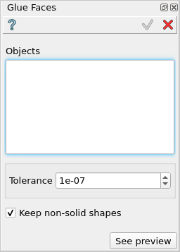

Glue Faces
==========

**Glue Faces** feature glues faces that are coincident with respect to the given tolerance value.

To perform **Glue Faces** in the active part:

#. select in the Main Menu *Features - > Glue Faces* item  or
#. click |glue_faces.icon| **Glue Faces** button in the toolbar

The following property panel appears:

   **Glue Faces**  property panel

Input fields:  

- **Objects** - contains a list of objects selected in the Object Browser or in the Viewer, on which faces will be glued.
- **Tolerance** - sets the tolerance value to be used for the gluing operation.
- **Keep non-solid shapes** - defines whether to keep non-solid shapes during the gluing operation.

**TUI Command**:

.. py:function:: model.addGlueFaces(Part_doc, objects, tolerance, keepNonSolid)

    :param part: The current part object.
    :param objects: A list of shapes for which faces should be glued.
    :param number: The tolerance value.
    :param boolean: *True* to keep non-solid shapes.
    :return: Created object.

Result
""""""

The result of the operation will be a compound shape with eliminated faces.
If no faces were glued, the result will be a compound with the original selected shapes.

**See Also** a sample TUI Script of :ref:`tui_create_glue_faces` operation.
