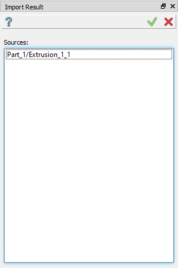
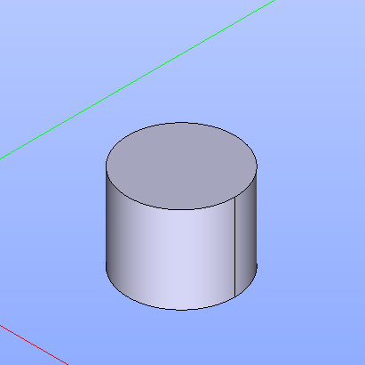

.. |import_result_btn.icon|    image:: images/import_result_btn.png

Import Result
=====

The Import Result feature allows the user to import one or several results from another Part. If the result of the source-part is
changed, the part and part result that contains the copy-results will be updated. The feature keeps the
copy-shape, so, even the document was opened and the source-part was not activated (loaded), the part with copy-feature works well
with this result-shape.

It may be necessary for the user to load the other parts before using this feature otherwise the content of the **Results** folders will be empty.

To create a Copy in the active part:

#. select in the Main Menu *Features - > Import Result* item  or
#. click |import_result_btn.icon| **Import Result** button in the toolbar

The following property panel will be opened:

.. centered::
   **Import result operation**

Here it is necessary to select one or several objects. It is only possible to import results from Parts placed before the
current Part where the import is done. Only results from the **Results** folder of previously created parts may be selected.

**Apply** button creates a copy.
  
**Cancel** button cancels the operation.

**TUI Command**:

.. py:function:: model.addImportResult(Part_doc, results)

    :param part: The current part object.
    :param results: A list of results from another part.
    :return: Result feature Import Result.

Result
""""""

The Result of the operation will be copy of one or several results selected in another part located in the same place:

.. centered::
   **Import result created**

**See Also** a sample TUI Script of :ref:`tui_create_import_result` operation.
