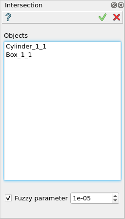
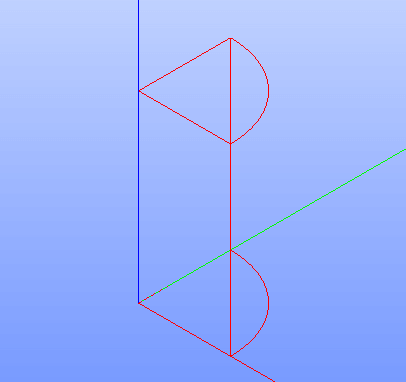

.. |intersection_btn.icon|    image:: images/intersection_btn.png

.. _featureIntersect:

Intersection
============

Intersection feature a boolean operation for intersection of a set of main objects with a set of tool objects.

To perform a boolean operation Intersection in the active part:

#. select in the Main Menu *Features - > Intersection* item  or
#. click |intersection_btn.icon| **Intersection** button in the toolbar

The following property panel will be opened:

   **Intersection operation**

**Objects** - contains a list of objects selected in the Object Browser or in the Viewer, which will be intersected.

All intersected objects should be 1- or 2-dimensional (edges, faces, shells). However, it is allowed to select 3-dimensional objects, but only their shells will be taken into operation.

**TUI Command**:

.. py:function:: model.addIntersection(Part_doc, Objects)

    :param part: The current part object.
    :param list: A list of objects.
    :return: Created object.

Result
""""""

The Result of the operation will be a shape which is an intersection of selected objects:

   **Intersection created**

**See Also** a sample TUI Script of :ref:`tui_create_intersection` operation.
