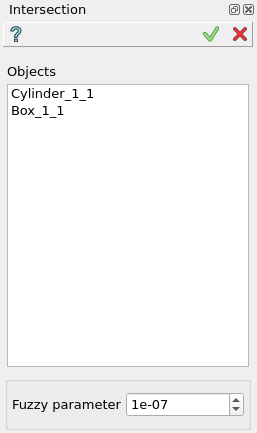

Intersection
============

Intersection feature a boolean operation for intersection of a set of main objects with a set of tool objects.

To perform a boolean operation Intersection in the active part:

#. select in the Main Menu *Features - > Intersection* item  or
#. click **Intersection** button in the toolbar

.. image:: images/intersection_btn.png
   :align: center

.. centered::
   **Intersection**  button 

The following property panel will be opened:

.. centered::
   **Intersection operation**

**Objects** - contains a list of objects selected in the Object Browser or in the Viewer, which will be intersected.

**TUI Command**:  *model.addIntersection(Part_doc, Objects)*

**Arguments**:   Part + list of objects.

Result
""""""

The Result of the operation will be a shape which is an intersection of selected objects:

.. image:: images/CreatedIntersection.png
	   :align: center

.. centered::
   **Intersection created**

**See Also** a sample TUI Script of :ref:`tui_create_intersection` operation.
