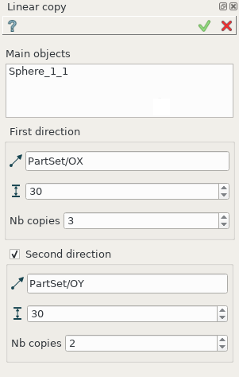
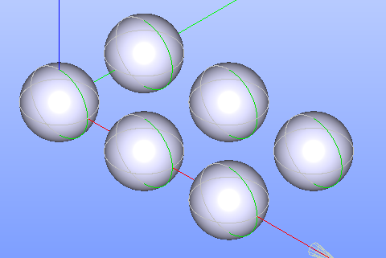

Linear copy
===========

**Linear copy** feature makes several translations of a selected shape in one or two directions.

To create a Linear copy in the active part:

#. select in the Main Menu *Part - > Linear copy* item  or
#. click |multitranslation.icon| **Linear copy** button in the toolbar

The following property panel appears.

   Linear copy property panel

Input fields:

- **Main objects** panel contains shapes to be translated. Shapes are selected in 3D OCC viewer or object browser;
- **First direction** defines translation in the first direction:

  - **Vector of translation**  defines vector along which the object will be translated. Vector is edge, axis selected in 3D OCC viewer or object browser;
  - **Step** defines the distance between the shape copies;
  - **Nb. Copies** is the number of shape copies;
 
- **Second direction** check-box turns on/off translation in the second direction:

  - **Vector of translation**  defines vector along which the object will be translated. Vector is edge, axis selected in 3D OCC viewer or object browser;
  - **Step** defines the distance between the shape copies;
  - **Nb. Copies** defines the number of shape copies.

**TUI Command**:

.. py:function:: model.addMultiTranslation(Part_doc, [shape], axis1, step1, Nb1, axis2, step2, Nb2)

    :param part: The current part object.
    :param list: A list of shapes in format *model.selection(TYPE, shape)*.
    :param object: A first axis in format *model.selection(TYPE, shape)*.
    :param real: The first step value.
    :param integer: The first number of copies.
    :param object: A second axis in format *model.selection(TYPE, shape)*.
    :param real: The second step value.
    :param integer: The second number of copies.
    :return: Created object.

Result
""""""
Result of operation is a compound.

   Linear copy

**See Also** a sample TUI Script of :ref:`tui_create_linearcopy` operation.