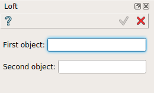
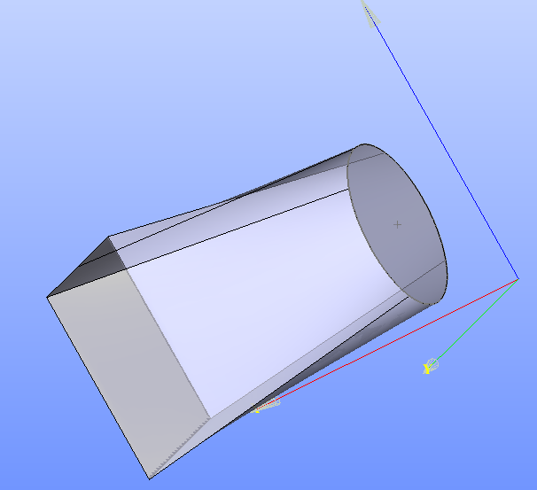

Loft
====

**Loft** feature is used to create a face, shell or a solid shape from two or more objects.
The two objects can be edges, wires or faces but must be of the same type

To create a Loft in the active part:

#. select in the Main Menu *Features - > Loft* item  or
#. click |loft.icon| **Loft** button in the toolbar

The following property panel appears.

   Loft property panel

Input fields:

- **First object** defines the first shape (edge, wire, face) selected in 3D OCC viewer or object browser;
- **Second object** defines the second shape (edge, wire, face) selected in 3D OCC viewer or object browser;

**TUI Command**:

.. py:function:: model.addLoft(Part_doc, [shape], [shape])

    :param part: The current part object.
    :param object: A shape in format *model.selection(TYPE, shape)*.
    :param object: A shape in format *model.selection(TYPE, shape)*.
    :return: Created object.

Result
""""""

Result of loft between two faces.

   Loft between two faces

**See Also** a sample TUI Script of :ref:`tui_loft` operation.
