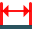

.. |measurement.icon|    image:: images/measurement.png

Measurement
===========

The feature **Measurement** calculates dimensions of sub-elements of a geometrical object (shape).

The measured dimension is displayed in the property panel and shown in 3D OCC viewer.

The  properties of dimension text and line, such as font, color, arrow size, etc. can be defined in the Preferences  :ref:`visualization_preferences`.

**Apply** button does not generate any result and has the same effect as **Cancel** for this feature.  

To start Measurement in the active part:

#. select in the Main Menu *Part - > Measurement* item  or
#. click |measurement.icon| **Measurement** button in the toolbar

The following dimensions can be calculated:

edge length 

.. image:: images/meas_distance_32x32.png    
   :align: left
   :height: 24px

distance between objects

.. image:: images/meas_radius_32x32.png    
   :align: left
   :height: 24px

radius

angle between edges  

.. image:: images/meas_angle3p_32x32.png    
   :align: left
   :height: 24px

angle by 3 points  

--------------------------------------------------------------------------------

Edge length
-----------

The length can be measured for straight or curved edge built on two points. 

.. image:: images/Measurement1.png
  :align: center

.. centered::
  Edge length

Input fields:

- **Edge**  contains  edge to be measured selected in 3D OCC viewer or object browser. 

Note, that for curved edges length is displayed only in the property panel.

**TUI Command**:

.. py:function:: model.measureLength(Part_doc, edge)
 
    :param part: The current part object.
    :param object: An edge in format *model.selection("EDGE", edge)*.
    :return: Calculated value.

Distance between objects
------------------------

**Distance between objects** calculates minimal distance for any pair of shapes: vertex, edge, face, solid.

 .. image:: images/Measurement2.png
  :align: center

.. centered::
  Distance between objects

Input fields:

- **From**, **To**  contain shapes between which distance is  measured. Shapes are selected in 3D OCC viewer or object browser. 

**TUI Command**:

.. py:function:: model.measureDistance(Part_doc, shape1, shape2)
 
    :param part: The current part object.
    :param object: A first edge in format *model.selection("EDGE", edge)*.
    :param object: A second edge in format *model.selection("EDGE", edge)*.
    :return: Calculated value.

Radius
------

**Radius** calculates radius for circular edge or cylindrical face. 

.. image:: images/Measurement3.png
  :align: center

.. centered::
  Radius

Input fields:

- **Object**  contains shape to be measured selected in 3D OCC viewer or object browser.  

**TUI Command**:

.. py:function:: model.measureRadius(Part_doc, shape)
 
    :param part: The current part object.
    :param object: An edge in format *model.selection("TYPE", shape)*.
    :return: Calculated value.

Angle between edges
-------------------

**Angle between edges** calculates angle between the selected pair of edges in the point of intersection. If there are several points of intersection, then angles are calculated in all points.

.. image:: images/Measurement4.png
  :align: center

.. centered::
  Angle between edges

Input fields:

- **First Edge**, **Second edge**  contain  edges between which angle is measured. Edges are selected in 3D OCC viewer or object browser. 

**TUI Command**:

.. py:function:: model.measureAngle(Part_doc, edge1, edge2)
 
    :param part: The current part object.
    :param object: A first edge in format *model.selection("TYPE", shape)*.
    :param object: A second edge in format *model.selection("TYPE", shape)*.
    :return: Calculated value.

Angle by 3 points
-----------------

**Angle by 3 points** calculates angle between the selected three points. The second point is in the corner of the angle.

.. image:: images/Measurement5.png
  :align: center

.. centered::
  Angle by 3 points

Input fields:

- **First point**, **Second point**, **Third point**  contain  point between which angle is measured. Points are selected in 3D OCC viewer or object browser. 

**TUI Command**:

.. py:function:: model.measureAngle(Part_doc, vertex1, vertex2, vertex3)
  
    :param part: The current part object.
    :param object: A first vertex in format *model.selection("TYPE", shape)*.
    :param object: A second vertex in format *model.selection("TYPE", shape)*.
    :param object: A third vertex in format *model.selection("TYPE", shape)*.
    :return: Calculated value.
 
