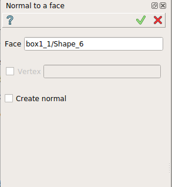
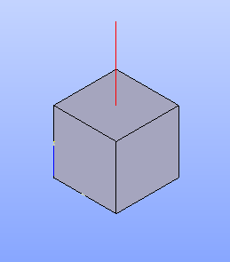

.. |normalToFace.icon|    image:: images/normal.png

Normal to a face
================

The **Normal to a face** feature displays the normal to a face. A vertex can be specified to indicate the position of the normal else the center of face is used. 

The resulting normal can be created via a dedicated check-box **Create normal**. If this last is checked corresponding result and feature would be created. 

If the check-box **Create normal** isn't checked, **Apply** button does not generate any result and has the same effect as **Cancel** for this feature.  

To display the normal to a face in the active part:

#. select in the Main Menu *Inspection - > Normal to a face* item  or
#. click |normalToFace.icon| **Normal to a face** button in the toolbar

The property panel is shown below.

   Normal to a face

Input fields:

- **Face** contains face selected in 3D OCC viewer or object browser. 
- **Vertex** contains optionnal vertex selected in 3D OCC viewer or object browser. 
- **Create normal** check-box allow the creation of the normal (result and feature). 

**TUI Command**:

.. py:function:: model.getNormal(Part, face)
 
    :param part: The current part object.
    :param object: A face in format *model.selection("FACE", face)*.
    :return: Created normal to a face in the center of the face.

Result
""""""

Result of **Normal to a face**.

   Normal to a face

**See Also** a sample TUI Script of :ref:`tui_create_normal_to_face` operation.

**TUI Command**:

.. py:function:: model.getNormal(Part, face, vertex)
 
    :param part: The current part object.
    :param object: A face in format *model.selection("FACE", face)*.
    :param object: A vertex in format *model.selection("VERTEX", vertex)*.
    :return: Created normal to a face at vertex.

Result
""""""

Result of **Normal to aface** where **Vertex** is selecteted.

.. figure:: images/normalToFaceResultWithVertex.png
   :align: center

   Normal to a face at vertex

**See Also** a sample TUI Script of :ref:`tui_create_normal_to_face_at_vertex` operation.
