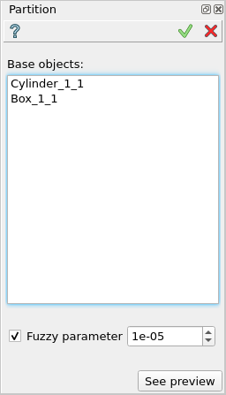

Partition
=========

The feature Partition implements a boolean operation for partitioning of a set of selected objects.

To perform a boolean opration Partition in the active part:

#. select in the Main Menu *Features - > Partition* item  or
#. click **Partition** button in the toolbar

.. image:: images/partition_btn.png
   :align: center

.. centered::
   **Partition**  button 

The following property panel will be opened:

.. centered::
   **Partition operation**

**Base Objects** contains a list of objects selected in the Object Browser or in the Viewer, which will be partitioned.

**TUI Command**:  *model.addPartition(Part_doc, objects)*

**Arguments**:   Part + list of objects.

Result
""""""

The Result of the operation will be a shape which is a partition of selected objects:

.. image:: images/CreatedPartition.png
	   :align: center

.. centered::
   **Partition created**

**See Also** a sample TUI Script of a :ref:`tui_create_partition` operation.
