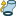
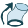
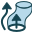
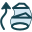
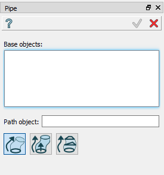
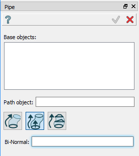
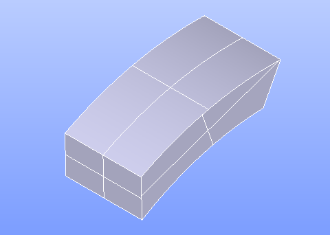
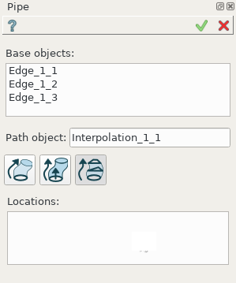
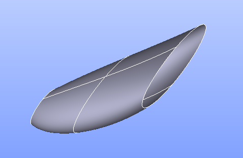

Pipe
====

**Pipe** feature makes an extruded Pipe shape.

To create a Pipe in the active part:

#. select in the Main Menu *Features - > Pipe* item  or
#. click |pipe.icon| **Pipe** button in the toolbar

Pipe can be created in three different ways:

by object and path 

by object, path and Bi-normal  

by object, path and locations 

--------------------------------------------------------------------------------

Pipe by object and path
-----------------------

Base Objects are extruded along the Path Object so that the angle between the normal vector to the base shape and the tangent to the path remain constant at any point of the given path. 

.. centered::
  Pipe by object and path property panel

Input fields:

- **Base objects** panel contains shapes to be extruded. Several Base Objects generate several pipes. Shapes (edges, faces, shells) are selected in 3D OCC viewer or object browser;
- **Path object**  defines the path along which the Base Object will be extruded.  **Path object** (edge or wire) is selected in 3D OCC viewer or object browser;

**TUI Command**:

.. py:function:: model.addPipe(Part_doc, [shape], path)
 
    :param part: The current part object.
    :param list: A list of shapes in format *model.selection(TYPE, shape)*.
    :param object: A path in format *model.selection(TYPE, shape)*.
    :return: Created object.

Result
""""""

Result of extrusion of an arc along another arc.

.. image:: images/simplePipe.png
   :align: center

.. centered::
   Pipe by object and path

**See Also** a sample TUI Script of ref:`tui_simple_pipe` operation.

Pipe by object, path and Bi-normal
----------------------------------

The pipe is generated to preserve the constant angle between the normal vector to the base shape and the BiNormal vector at any point of the given path. 

.. centered::
  Pipe by object, path and Bi-normal property panel

Input fields:

- **Base objects** panel contains shapes to be extruded. Several Base Objects generate several pipes. Shapes (edges, faces, shells) are selected in 3D OCC viewer or object browser;
- **Path object**  defines the path along which the Base Object will be extruded.  **Path object** (edge or wire) is selected in 3D OCC viewer or object browser;
- **Bi-Normal** defines the BiNormal Vector. **Bi-Normal** (edge or wire) is selected in 3D OCC viewer or object browser.

**TUI Command**:

.. py:function:: model.addPipe(Part_doc, [shape], path, binormal)
 
    :param part: The current part object.
    :param list: A list of shapes in format *model.selection(TYPE, shape)*.
    :param object: A path in format *model.selection(TYPE, shape)*.
    :param object: A binormal in format *model.selection(TYPE, shape)*.
    :return: Created object.

Result
""""""

Result of extrusion of a rectangular face along  arc.

.. centered::
   Pipe by object, path and Bi-normal

**See Also** a sample TUI Script of :ref:`tui_binormal_pipe` operation.

Pipe by object, path and locations
----------------------------------

The pipe is generated to preserve selected profiles at the specified locations along the path.

.. centered::
  Pipe by object, path and locations property panel

Input fields:

- **Base objects** panel contains shapes to be extruded.  Shapes (edges, faces, shells) are selected in 3D OCC viewer or object browser;
- **Path object**  defines the path along which the Base Object will be extruded.  **Path object** (edge or wire) is selected in 3D OCC viewer or object browser;
- **Locations** define the list of vertices that specify the locations of extruded Base Objects on the resulting Path Object. The number of Base Objects should be equal to the number of Locations.

**TUI Command**:

.. py:function:: model.addPipe(Part_doc, [shape], path, locations)
 
    :param part: The current part object.
    :param list: A list of shapes in format *model.selection(TYPE, shape)*.
    :param object: A path in format *model.selection(TYPE, shape)*.
    :param list: A list of locations in format *model.selection(TYPE, shape)*.
    :return: Created object.

Result
""""""

Result of extrusion of 3 circles along arc with specified locations.

.. centered::
   Pipe by object, path and locations

**See Also** a sample TUI Script of :ref:`tui_locations_pipe` operation.
