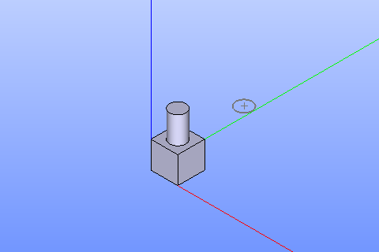

.. |placement_btn.icon|    image:: images/placement_btn.png

Placement
=========

Placement defines position of an object relatively to another object. To make a placement:

#. select in the Main Menu *Part - > Placement* item  or
#. click |placement_btn.icon| **Placement** button in the toolbar

The following property panel will be opened:

.. image:: images/Placement.png
  :align: center

.. centered::
   **Placement operation**

In this property panel, it is necessary to:

-  Select objects which will be moved;

-  Select a face, edge or vertex as a start for moving;

-  Select a face, edge or vertex as an end of moving;

-  Define state of **Reverse** and **Centering** check boxes.

**Apply** button creates the placement.
  
**Cancel** button cancels the operation.

**TUI Command**:

.. py:function:: model.addPlacement(Part_doc, placeObjects, startShape, endShape, isReverse, isCentering)

    :param part: The current part object.
    :param list: A list of objects to move.
    :param object: A start shape.
    :param object: A end shape.
    :param bool: Is reverse flag.
    :param bool: Is centering flag.
    :return: Created object.

Result
""""""

The Result of the operation will be a new placement of selected objects:

.. centered::
   **Placement created**

**See Also** a sample TUI Script of :ref:`tui_create_placement` operation.
