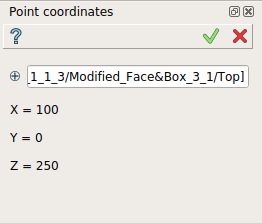

.. |point_coord.icon|    image:: images/point_coord.png

Point Coordinates
=================

The **Points coordinates** feature displays the coordinates of a selected point.

The coordinates are displayed in the property panel.

**Apply** button does not generate any result and has the same effect as **Cancel** for this feature.  

To display Point coordinates in the active part:

#. select in the Main Menu *Inspection - > Point coordinates* item  or
#. click |point_coord.icon| **Points coordinates** button in the toolbar

The coordinates can be displayed for a selected point in the property panel : 

   Point coordinates

Input fields:

- Input field contains a point selected in 3D OCC viewer or object browser. 

Note, the coordinates displayed can be selected.

**TUI Command**:

.. py:function:: model.getPointCoordinates(Part_doc, point)

    :param part: The current part object.
    :param object: A point in format *model.selection("VERTEX", shape)*.
    :return: list of coordinates.

**See Also** a sample TUI Script of :ref:`tui_point_coordinates` operation.