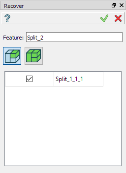
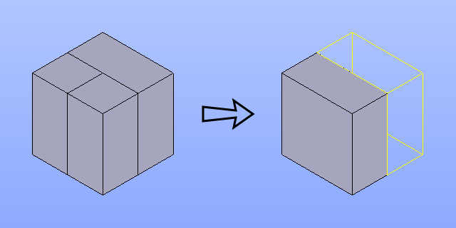
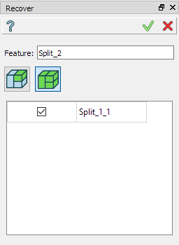
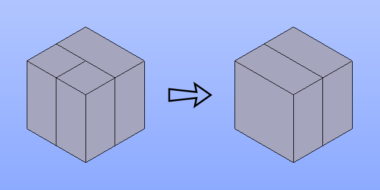

.. |recover.icon|    image:: images/recover.png

Recover
=======

**Recover** feature restores some objects used in previous operations.

To recover in the active part:

#. select in the Main Menu *Features - > Recover* item or
#. click |recover.icon| **Recover** button in the toolbar

The feature has the following options:

restore only the objects used in the operation

restore full compound/compsolid if the operation used one or more of its sub-shapes

Recover objects
---------------

.. centered::
   Recover objects used in operation

- **Feature** field contains one of the previous operations;
- **List of recovered** objects contains all the shapes used in the operation. Need to enable checkbox to restore a shape.

**TUI Command**:

.. py:function:: model.addRecover(Part_doc, feature, [recovering_results])

    :param part: The current part object.
    :param string: The name of the feature.
    :param list: A list of results used in the feature.
    :return: Created object.

Result
""""""

Result of restoring the shape used in Split operation in compsolid is a single solid.

.. centered::
   Recover a solid

**See also** a sample TUI script of ref:`tui_recover_default` operation.

Recover top-level objects
-------------------------

.. centered::
   Recover top-level compounds/compsolids of objects used in operation

- **Feature** field contains one of the previous operations;
- **List of recovered** objects contains all top-level shapes (compounds/compsolids) of the shapes used in the operation. Need to enable checkbox to restore a shape.

**TUI Command**:

.. py:function:: model.addRecover(Part_doc, feature, [recovering_results], True)

    :param part: The current part object.
    :param string: The name of the feature.
    :param list: A list of results used in the feature.
    :param boolean: *True* to specify restoring compounds.
    :return: Created object.

Result
""""""

Result of restoring the shape used in Split operation in compsolid is a full compsolid.

.. centered::
   Recover a compsolid

**See also** a sample TUI script of ref:`tui_recover_compound` operation.
