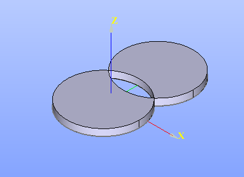

Remove Sub-Shapes
=================

Remove Sub-Shapes allows removing sub shapes from wires, shells, compsolids and compounds.

To Remove Sub-Shapes in the active part:

#. select in the Main Menu *Features - > Remove Sub-Shapes* item  or
#. click |remove_subshapes_btn.icon| **Remove Sub-Shapes** button in the toolbar

The following property panel will be opened:

.. figure:: images/RemoveSubShapes.png
  :align: center

  Remove Sub-Shapes

.. |by_removing| image:: images/remove_subshapes_32x32.png
.. |by_keeping| image:: images/keep_subshapes_32x32.png

- **Shape** shape from which sub-shapes should be removed. Only wires, shells, compsolids or compounds are allowed for selection.

There are 2 options for removing sub-shapes:

|by_removing| **By removing** allows selecting sub-shapes to be removed.

- **Sub-Shapes to remove** the list of sub-shapes which should be removed.

**TUI Command**:

.. py:function:: model.addRemoveSubShapes(Part_1_doc, object)

    :param part: The current part object.
    :param object: The object.
    :return: Created object.

.. py:function:: Remove_SubShapes_1.setSubShapesToRemove(subShapes)

    :param list: A list of objects.

|by_keeping| **By keeping** allows select sub-shapes to be kept.

- **Sub-Shapes to keep** the list of sub-shapes which should be kept.

**TUI Command**:

.. py:function:: model.addRemoveSubShapes(Part_1_doc, object)

    :param part: The current part object.
    :param object: The object.
    :return: Created object.

.. py:function:: Remove_SubShapes_1.setSubShapesToKeep(subShapes)

    :param list: A list of sub-shapes to keep.

Result
""""""

The Result of the operation will be a shape without removed sub-shapes:

   **Remove Sub-Shapes**

**See Also** a sample TUI Script of :ref:`tui_create_remove_subshapes` operation.
