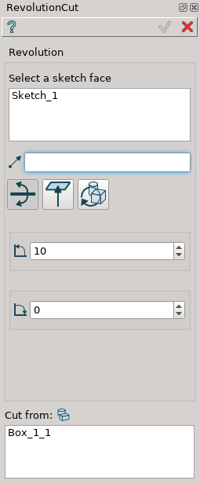
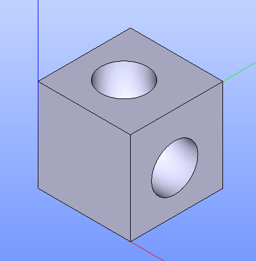

Revolution Cut
==============

Revolution Cut feature revolves selected objects around selected axis and cuts result from other objects.

To perform Revolution Cut in the active part:

#. select in the Main Menu *Features - > Revolution Cut* item  or
#. click **Revolution Cut** button in the toolbar

.. image:: images/revolution_cut_btn.png
   :align: center

.. centered::
   **Revolution Cut** button

The following property panel will be opened:

.. image:: images/StartSketch.png
  :align: center

.. centered::
  Start sketch

After selecting one of the options property panel for Revolution Cut will be opened with two variants:

.. image:: images/revolution_by_angles.png
   :align: left
**By Angles** revolves objects by specifying angles.

.. image:: images/revolution_by_bounding_planes.png
   :align: left
**By Bounding Planes** revolves objects by specifying bounding planes and angles.

By angles
--------

.. centered::
  Revolution Cut: definition by angles

- **Base objects** contains a list of objects selected in the Object Browser or in the Viewer, which will be revolved.
- **Axis** axis of revolution.
- **To angle** end angle of revolution.
- **From angle** start angle of revolution.
- **Cut from** contains a list of objects which will but cut with the result of revolution.

**TUI Command**:  *model.addRevolutionCut(part, objectsToRevolve, axis, angle, objectToCut);*

**Arguments**:   Part + list of objects for revolution + axis + angle + list of objects to cut from.

**TUI Command**:  *model.addRevolutionCut(part, objectsToRevolve, axis, toAngle, fromAngle, objectToCut);*

**Arguments**:   Part + list of objects for revolution + axis + to angle + from angle + list of objects to cut from.

Result
""""""

The Result of the operation will be an revolved shape:

.. centered::
   **Revolution Cut created**

**See Also** a sample TUI Script of a :ref:`tui_create_revolution_cut_by_angles` operation.

By bounding planes
------------------

.. image:: images/RevolutionCut2.png
  :align: center

.. centered::
  Revolution Cut: definition by bounding planes

- **Base objects** contains a list of objects selected in the Object Browser or in the Viewer, which will be revolved.
- **Axis** axis of revolution.
- **To plane** planar face can be selected to bound revolution from one side.
- **To offset** offset for revolution or for bounding plane if selected.
- **From plane** planar face can be selected to bound revolution from other side.
- **From offset** offset for revolution or for bounding plane if selected.
- **Cut from** contains a list of objects which will but cut with the result of revolution.

**TUI Command**:  *model.addRevolutionCut(part, objectsToRevolve, axis, toObject, toOffset, fromObject, fromOffset, objectToCut);*

**Arguments**:   Part + list of objects for revolution + axis + to object + to offset + from object + from offset + list of objects to cut from.

Result
""""""

The Result of the operation will be an revolved shape:

.. image:: images/revolution_cut_by_bounding_planes_result.png
	   :align: center

.. centered::
   **Revolution Cut created**

**See Also** a sample TUI Script of a :ref:`tui_create_revolution_cut_by_bounding_planes` operation.