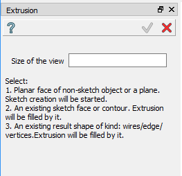
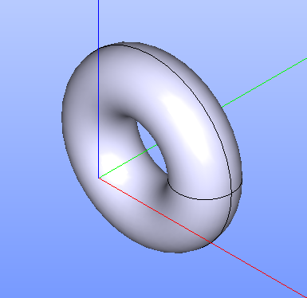

Revolution
==========

Revolution feature revolves selected objects around selected axis.

To perform a Revolution in the active part:

#. select in the Main Menu *Features - > Revolution* item  or
#. click **Revolution** button in the toolbar

.. centered::
   **Revolution** button

The following property panel will be opened:

.. centered::
  Start sketch

There are two variants of the property panel for Revolution depending on the chosen option:

.. image:: images/revolution_by_angles.png
   :align: left
**By Angles** revolves objects by specifying angles.

.. image:: images/revolution_by_bounding_planes.png
   :align: left
**By Bounding Planes** revolves objects by specifying bounding planes and angles.

By angles
--------

.. image:: images/Revolution1.png
  :align: center

.. centered::
  Revolution: definition by angles

- **Base objects** - contains a list of objects selected in the Object Browser or in the Viewer, which will be revolved.
- **Axis** - axis of revolution.
- **To angle** - end angle of revolution.
- **From angle** - start angle of revolution.

**TUI Command**:  *model.addRevolution(part, objects, axis, angle);*

**Arguments**:   Part + list of objects + axis + angle.

**TUI Command**:  *model.addRevolution(part, objects, axis, toSize, fromSize);*

**Arguments**:   Part + list of objects + axis + to angle + from angle.

Result
""""""

The Result of the operation will be a revolved shape:

.. centered::
   **Revolution created**

**See Also** a sample TUI Script of :ref:`tui_create_revolution_by_angles` operation.

By bounding planes
------------------

.. image:: images/Revolution2.png
  :align: center

.. centered::
  Revolution: definition by bounding planes

- **Base objects** - contains a list of objects selected in the Object Browser or in the Viewer, which will be revolved.
- **Axis** - axis of revolution.
- **To plane**  - a planar face can be selected to bound revolution from one side.
- **To offset** - offset for revolution or for bounding plane, if selected.
- **From plane** - a planar face can be selected to bound revolution from other side.
- **From offset** - offset for revolution or for bounding plane, if selected.

**TUI Command**:  *model.addRevolution(part, objects, axis, toObject, toOffset, fromObject, fromOffset);*

**Arguments**:   Part + list of objects + axis + to object + to offset + from object + from offset.

Result
""""""

The Result of the operation will be a revolved shape:

.. image:: images/revolution_by_bounding_planes_result.png
	   :align: center

.. centered::
   **Revolution created**

**See Also** a sample TUI Script of :ref:`tui_create_revolution_by_bounding_planes` operation.