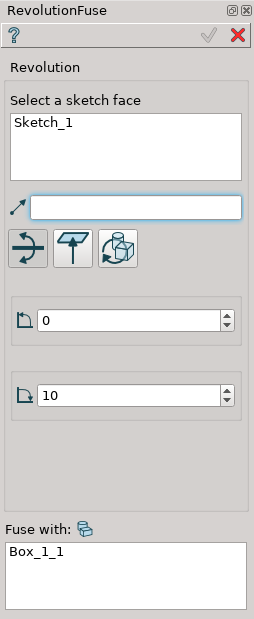
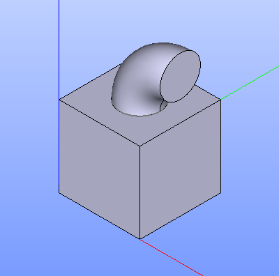
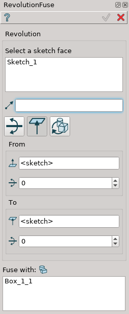
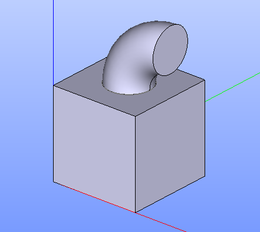
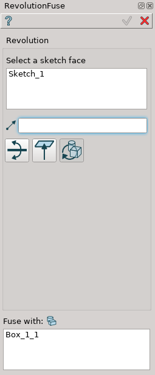
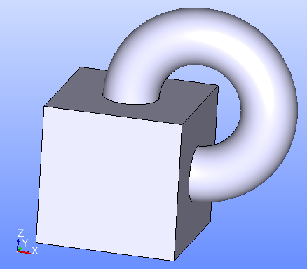

.. |revolution_fuse_btn.icon|    image:: images/revolution_fuse_btn.png

Revolution Fuse
===============

Revolution Fuse feature revolves the selected objects around the selected axis and fuses the result with other objects.

To perform Revolution Fuse in the active part:

#. select in the Main Menu *Features - > Revolution Fuse* item  or
#. click |revolution_fuse_btn.icon| **Revolution Fuse** button in the toolbar

The following property panel will be opened:

.. image:: images/StartSketch.png
  :align: center

.. centered::
  Start sketch
  
There are three variants of the property panel for Revolution Fuse depending on the chosen option:

.. image:: images/revolution_by_angles.png
   :align: left
**By Angles** revolves objects by specifying angles.

.. image:: images/revolution_by_bounding_planes.png
   :align: left
**By Bounding Planes** revolves objects by specifying bounding planes and angles.

.. image:: images/revolution_through_all.png
   :align: left
**Through All** revolves objects by 360 degrees.

By angles
--------

.. centered::
  Revolution Fuse: definition by angles

- **Base objects** - contains a list of objects selected in the Object Browser or in the Viewer, which will be revolved.
- **Axis** - axis of revolution.
- **To angle** - end angle of revolution.
- **From angle**-  start angle of revolution.
- **Fuse with** contains a list of objects which will be fused with the result of revolution.

**TUI Command**:

.. py:function:: model.addRevolutionFuse(part, objectsToRevolve, axis, angle, objectToFuse)

    :param part: The current part object.
    :param list: A list of objects for revolution.
    :param object: An axis.
    :param real: Angle.
    :param list: A list of objects to fuse with.
    :return: Created object.

.. py:function:: model.addRevolutionFuse(part, objectsToRevolve, axis, toAngle, fromAngle, objectToFuse)

    :param part: The current part object.
    :param list: A list of objects for revolution.
    :param object: An axis.
    :param real: To angle.
    :param real: From angle.
    :param list: A list of objects to fuse with.
    :return: Created object.

Result
""""""

The Result of the operation will be a revolved shape:

.. centered::
   **Revolution Fuse created**

**See Also** a sample TUI Script of :ref:`tui_create_revolution_fuse_by_angles` operation.

By bounding planes
------------------

.. centered::
  Revolution Fuse: definition by bounding planes

- **Base objects** - contains a list of objects selected in the Object Browser or in the Viewer, which will be revolved.
- **Axis** - axis of revolution.
- **To plane** - a planar face can be selected to bound revolution from one side.
- **To offset** - offset for revolution or for bounding plane, if selected.
- **From plane** - a planar face can be selected to bound revolution from other side.
- **From offset** - offset for revolution or for bounding plane, if selected.
- **Fuse with** - contains a list of objects which will be fused with the result of revolution.

**TUI Command**:

.. py:function:: model.addRevolutionFuse(part, objectsToRevolve, axis, toObject, toOffset, fromObject, fromOffset, objectToFuse)

    :param part: The current part object.
    :param list: A list of objects for revolution.
    :param object: An axis.
    :param object: To object.
    :param real: To offset.
    :param object: From object.
    :param real: From offset.
    :param list: A list of objects to fuse with.
    :return: Created object.

Result
""""""

The Result of the operation will be a revolved shape:

.. centered::
   **Revolution Fuse created**

**See Also** a sample TUI Script of :ref:`tui_create_revolution_fuse_by_bounding_planes` operation.

Through All
-----------

.. centered::
  Revolution Fuse: definition by bounding planes

- **Base objects** - contains a list of objects selected in the Object Browser or in the Viewer, which will be revolved.
- **Axis** - axis of revolution.
- **Fuse with** - contains a list of objects which will be fused with the result of revolution.

**TUI Command**:

.. py:function:: model.addRevolutionFuse(part, objectsToRevolve, axis, objectToFuse)

    :param part: The current part object.
    :param list: A list of objects for revolution.
    :param object: An axis.
    :param list: A list of objects to fuse with.
    :return: Created object.

Result
""""""

The Result of the operation will be a revolved shape:

.. centered::
   **Revolution Fuse created**

**See Also** a sample TUI Script of :ref:`tui_create_revolution_fuse_through_all` operation.
