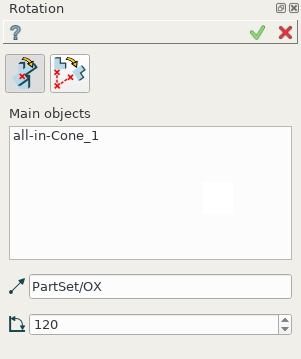
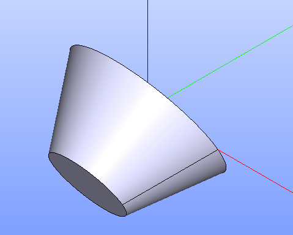
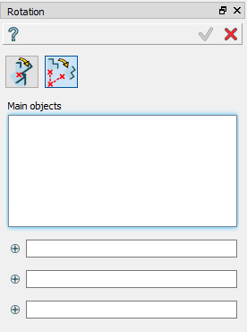
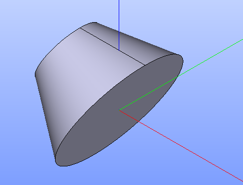

.. _featureRotation:

Rotation
========

**Rotation** feature makes rotation of a selected shape.

To create a Rotation in the active part:

#. select in the Main Menu *Part - > Rotation* item  or
#. click **Rotation** button in the toolbar

.. image:: images/rotation.png      
   :align: center

.. centered::
   **Rotation** button 

Two rotation algorithms are:

  .. image:: images/rotation_axis_32x32.png      
    :align: left
  by axis and angle 

  .. image:: images/rotation_3pt_32x32.png    
    :align: left
  by center and 2 points

Rotation by axis and angle
--------------------------

.. centered::
  Rotation by axis and angle property panel

Input fields:

- **Main objects** panel contains shapes to be rotated. Shapes are selected in 3D OCC viewer or object browser;
- **Axis** defines the axis of rotation. The vector is an edge or axis selected in 3D OCC viewer or object browser;
- **Angle** defines the angle by which the object is rotated. 

**TUI Command**:  *model.addRotation(Part_doc, [shape], axis, angle)*

**Arguments**: part + list of shapes in format *model.selection(TYPE, shape)* + axis in format *model.selection(TYPE, shape)*+ real (angle value).

Result
""""""

Result of operation is a rotated initial shape.

.. centered::
   Rotation by axis and angle

**See Also** a sample TUI Script of :ref:`tui_rotation_axis` operation.

Rotation by center and points
-----------------------------

.. centered::
  Rotation by center and 2 points property panel

Input fields:

- **Main objects** panel contains shapes to be rotated. Shapes are selected in 3D OCC viewer or object browser;
- **Center point**, **Start point**, **End point** define 3 points or vertices selected in 3D OCC viewer or object browser. Rotation axis will pass through the **Center point** and will be orthogonal to a plane defined by three points. Rotation Angle is the angle between two vectors directed from the **Center point** to **Start point** and **End point**.  

**TUI Command**:  *model.addRotation(Part_doc, [shape], point1, point2, point3)*

**Arguments**: part + list of shapes in format *model.selection(TYPE, shape)* + 3 points in format *model.selection(TYPE, shape)*.

Result
""""""

Result of operation is a rotated initial shape.

.. centered::
   Rotation by center and 2 points

**See Also** a sample TUI Script of :ref:`tui_rotation_3points` operation.