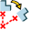

.. _featureRotation:
.. |rotation.icon|    image:: images/rotation.png

Rotation
========

**Rotation** feature makes rotation of a selected shape.

To create a Rotation in the active part:

#. select in the Main Menu *Part - > Rotation* item  or
#. click |rotation.icon| **Rotation** button in the toolbar

Two rotation algorithms are:

by axis and angle 

by center and 2 points

--------------------------------------------------------------------------------

Rotation by axis and angle
--------------------------

.. figure:: images/Rotation1.png
   :align: center

   Rotation by axis and angle property panel

Input fields:

- **Main objects** panel contains shapes to be rotated. Shapes are selected in 3D OCC viewer or object browser; :ref:`transformation_subshapes`
- **Axis** defines the axis of rotation. The vector is an edge or axis selected in 3D OCC viewer or object browser;
- **Angle** defines the angle by which the object is rotated. 

**TUI Command**:

.. py:function:: model.addRotation(Part_doc, [shape], axis, angle)

    :param part: The current part object.
    :param list: A list of shapes in format *model.selection(TYPE, shape)*.
    :param object: An axis in format *model.selection(TYPE, shape)*.
    :param real: An angle.
    :return: Rotated object.

Result
""""""

Result of operation is a rotated initial shape.

.. figure:: images/rotation_axis.png
   :align: center

   Rotation by axis and angle

**See Also** a sample TUI Script of :ref:`tui_rotation_axis` operation.

Rotation by center and points
-----------------------------

.. figure:: images/Rotation2.png
   :align: center

   Rotation by center and 2 points property panel

Input fields:

- **Main objects** panel contains shapes to be rotated. Shapes are selected in 3D OCC viewer or object browser; :ref:`transformation_subshapes`
- **Center point**, **Start point**, **End point** define 3 points or vertices selected in 3D OCC viewer or object browser. Rotation axis will pass through the **Center point** and will be orthogonal to a plane defined by three points. Rotation Angle is the angle between two vectors directed from the **Center point** to **Start point** and **End point**.  

**TUI Command**:

.. py:function:: model.addRotation(Part_doc, [shape], point1, point2, point3)*

    :param part: The current part object.
    :param list: A list of shapes in format *model.selection(TYPE, shape)*.
    :param object: An axis in format *model.selection(TYPE, shape)*.
    :param object: Center vertex.
    :param object: Start vertex.
    :param object: End vertex.
    :return: Rotated object.

Result
""""""

Result of operation is a rotated initial shape.

.. figure:: images/rotation_3points.png
   :align: center

   Rotation by center and 2 points

**See Also** a sample TUI Script of :ref:`tui_rotation_3points` operation.
