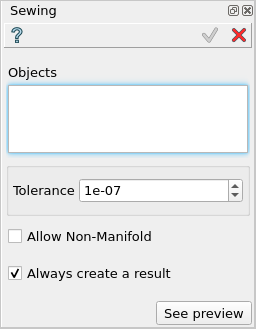

.. _featureSewing:

Sewing
======

Sewing feature unites several faces (possibly contained in a shell, solid or compound)
into one shell. Geometrically coincident (within a specified tolerance) edges (or parts
of edges) of different faces are replaced by one edge thus producing a shell or faces
with shared boundaries.

To perform the Sewing in the active part:

#. select in the Main Menu *Features - > Sewing* item  or
#. click |sewing_btn.icon| **Sewing** button in the toolbar

The following property panel will be opened:

   **Sewing feature**

Input fields:

- **Objects** contains a list of objects selected in the Object Browser or in the Viewer, which will be sewn.
- **Tolerance** defines the tolerance to use for the Sewing operation.
- **Allow Non-Manifold** allows to create non-manifold shapes, if checked.
- **Always create a result** allows to always create a result shape, even if there was nothing sewn.

**TUI Command**:

.. py:function:: model.addSewing(Part_doc, objects, tolerance, allowNonManifold, createResult)

    :param part: The current part object.
    :param list: A list of objects.
    :param real: The tolerance value to be used for the sewing.
    :param boolean: Defines whether to allow non-manifold results.
    :param boolean: Defines whether to always create a result.
    :return: Created object.

Result
""""""

The Result of the operation will be a shape with all coincident edges being united:

**See Also** a sample TUI Script of :ref:`tui_create_sewing` operation.
