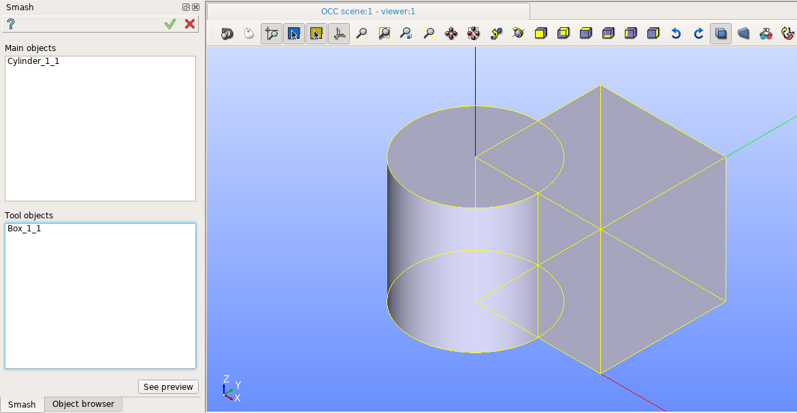
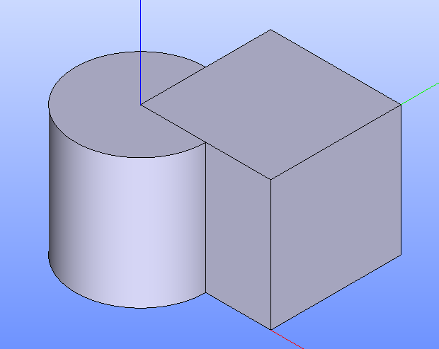

.. |bool_smash.icon|    image:: images/bool_smash.png

Smash
=====

Smash feature implements a boolean operation for smashing a set of main objects by a set of tool objects.

To create a Smash in the active part:

#. select in the Main Menu *Features - > Smash* item  or
#. click |bool_smash.icon| **Smash** button in the toolbar

The following property panel will be opened:

.. centered::
  **Smash operation**

- **Main Objects** contains a list of objects selected in the Object Browser or in the Viewer, which will be smashed by tool objects.
  If a subshape that belongs to a compsolid/compound was selected, other shapes of this compsolid/compound will be cut from
  other objects (to avoid self intersection) and added to the result.
- **Tool Objects** contains a list of objects selected in the Object Browser or in the Viewer, which will be smashed into main objects.
  If a subshape that belongs to a compsolid/compound was selected, other shapes of this compsolid/compound will be ignored.
- **See preview** button shows a result of the operation.

**TUI Command**:

.. py:function:: model.addSmash(Part_doc, mainObjects, toolObjects)

    :param part: The current part object.
    :param list: A list of main objects.
    :param list: A list of tool objects.
    :return: Rotated object.

Result
""""""

The Result of the operation will be a shape which is a smash of tool objects from main objects:

.. centered::
   **Smash created**

**See Also** a sample TUI Script of :ref:`tui_create_smash` operation.
