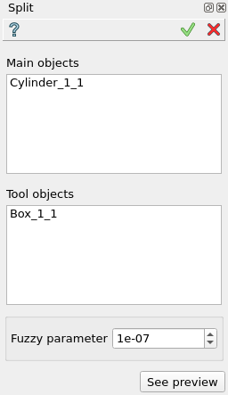

.. |bool_split.icon|    image:: images/bool_split.png
   :height: 16px

.. _featureSplit:

Split
=====

Split feature implements a Boolean operation splitting of main objects by parts of tool objects.

To perform Split in the active part:

#. select in the Main Menu *Features - > Split* item  or
#. click |bool_split.icon| **Split** button in the toolbar

The following property panel will be opened:

   **Split operation**

- **Main Objects** contains a list of objects selected in the Object Browser or in the Viewer, which will be cut and splitted by tool objects.
- **Tool Objects** contains a list of objects selected in the Object Browser or in the Viewer, which will cut and split the main objects. Construction planes may be selected too.
- **Fuzzy Parameter** defines the additional tolerance value used to eliminate tiny results.
- **See preview** button shows a result of the operation.

**TUI Command**:

.. py:function:: model.addSplit(Part_doc, mainObjects, toolObjects, fuzzy)

    :param part: The current part object.
    :param list: A list of main objects.
    :param list: A list of tool objects.
    :param real: Additional tolerance used to eliminate tiny results (optional).
    :return: Result object.

Result
""""""

The Result of the operation will be a shape, which is a split of tool objects with main objects:

.. figure:: images/CreatedSplit.png
   :align: center

   **Split created**

**See Also** a sample TUI Script of :ref:`tui_create_bool_split` operation.
