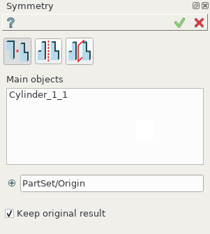
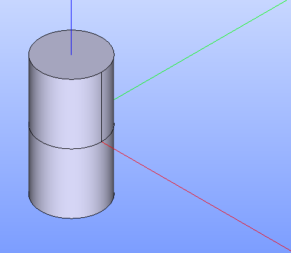
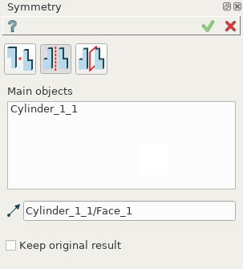
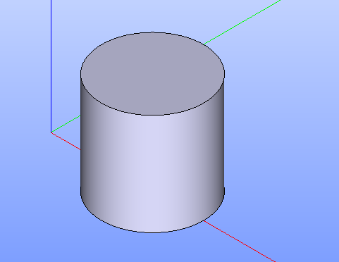
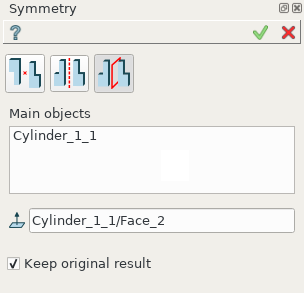

.. |symmetry.icon|    image:: images/symmetry.png

Symmetry
========

**Symmetry** feature makes a symmetrical copy of the selected shape.

To create a Symmetry in the active part:

#. select in the Main Menu *Part - > Symmetry* item  or
#. click |symmetry.icon| **Symmetry** button in the toolbar

Symmetrical copy of an Object can be mirrored in three different ways:

.. image:: images/symmetry_point_32x32.png    
   :align: left
   :height: 24px

through a Point of symmetry 

.. image:: images/symmetry_axis_32x32.png      
   :align: left
   :height: 24px

through an Axis of symmetry  

through a Plane of symmetry 

--------------------------------------------------------------------------------

Symmetry through a Point of symmetry
------------------------------------

.. centered::
  Symmetry through a Point of symmetry property panel

Input fields:

- **Main objects** panel contains shapes to be translated. Shapes are selected in 3D OCC viewer or object browser;
- **Point**  defines a point of symmetry selected in 3D OCC viewer or object browser;
- **Create a copy** checkbox preserves/removes the initial object.

**TUI Command**:

.. py:function:: model.addSymmetry(Part_doc, [shape], point, copy)

    :param part: The current part object.
    :param list: A list of shapes in format *model.selection(TYPE, shape)*.
    :param object: A point in format *model.selection(TYPE, shape)*.
    :param boolean: A flag to create a copy.
    :return: Result object.

Result
""""""

The result of operation is a mirrored initial shape with **Create a copy** = *True*.

.. centered::
   Symmetry through a Point of symmetry

**See Also** a sample TUI Script of :ref:`tui_symmetry_point` operation.

Symmetry through an Axis of symmetry
------------------------------------

.. centered::
  Symmetry through an Axis of symmetry property panel

Input fields:

- **Main objects** panel contains shapes to be translated. Shapes are selected in 3D OCC viewer or object browser;
- **Axis**  defines an axis of symmetry selected in 3D OCC viewer or object browser;
- **Create a copy** checkbox preserves/removes the initial object.

**TUI Command**:

.. py:function:: model.addSymmetry(Part_doc, [shape], axis, copy)

    :param part: The current part object.
    :param list: A list of shapes in format *model.selection(TYPE, shape)*.
    :param object: An axis in format *model.selection(TYPE, shape)*.
    :param boolean: A flag to create a copy.
    :return: Result object.

Result
""""""

The result of operation is a mirrored initial shape with **Create a copy** = *False*.

.. centered::
   Symmetry through an Axis of symmetry

**See Also** a sample TUI Script of :ref:`tui_symmetry_axis` operation.  

Symmetry through a Plane of symmetry
------------------------------------

.. centered::
  Symmetry through a Plane of symmetry property panel

Input fields:

- **Main objects** panel contains shapes to be translated. Shapes are selected in 3D OCC viewer or object browser;
- **Plane**  defines a plane of symmetry selected in 3D OCC viewer or object browser;
- **Create a copy** checkbox preserves/removes the initial object.

**TUI Command**:

.. py:function:: model.addSymmetry(Part_doc, [shape], plane, copy)

    :param part: The current part object.
    :param list: A list of shapes in format *model.selection(TYPE, shape)*.
    :param object: A plane in format *model.selection(TYPE, shape)*.
    :param boolean: A flag to create a copy.
    :return: Result object.

Result
""""""

The result of operation is a mirrored initial shape with **Create a copy** = *False*.

.. image:: images/symmetryPlaneres.png
   :align: center

.. centered::
   Symmetry through a Plane of symmetry

**See Also** a sample TUI Script of :ref:`tui_symmetry_plane` operation.   
