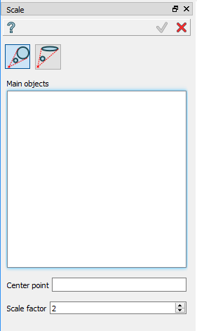
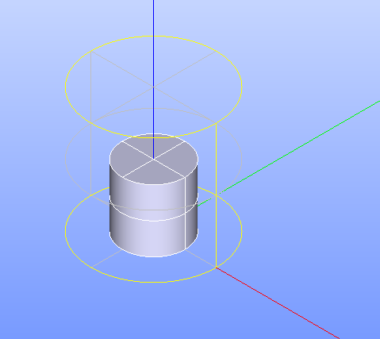
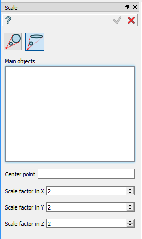
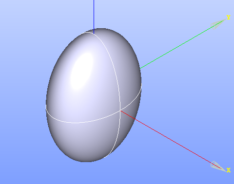

.. |scale.icon|    image:: images/scale.png

Scale
=====

**Scale** feature makes a scaled shape basing on the initial shape.

To create a Scale in the active part:

#. select in the Main Menu *Features - > Scale* item  or
#. click |scale.icon| **Scale** button in the toolbar

Two Scale algorithms are:

  .. image:: images/scale_factor_32x32.png    
    :align: left
  by one common factor 

  .. image:: images/scale_dimensions_32x32.png    
    :align: left
  by different factors along axes

Scale by one common factor
--------------------------

Scale by one common factor scales the entire object without modification the geometry of the shape: dimensions change evenly in all three orthogonal directions.

.. centered::
  Scale by one common factor property panel

Input fields:

- **Main objects** panel contains shapes to be scaled. Shapes are selected in 3D OCC viewer or object browser;
- **Center point** defines the point relatively to which the object is scaled. Point is selected in 3D OCC viewer or object browser;
- **Scale factor** defines the multiplier of axial dimensions. If Scale Factor is negative, the object is mirrored through the Central Point. 

**TUI Command**:

.. py:function:: model.addScale(Part_doc, [shape], center, factor)
 
    :param part: The current part object.
    :param list: A list of shapes in format *model.selection(TYPE, shape)*.
    :param object: A center point in format *model.selection(TYPE, shape)*.
    :param real: Scale factor.
    :return: Result object.

Result
""""""

Result of operation is transformed initial shape shown in wireframe mode together  with initial shape in shading mode.

.. centered::
   Scale by one common factor

**See Also** a sample TUI Script of :ref:`tui_Scale_common_factor` operation.  

Scale by different factors along axes
-------------------------------------

Scale by different factors along axes is a general transformation, which can modify the geometry, for example, a sphere can be transformed into an ellipsoid.

.. centered::
  Scale: define by different factors property panel

Input fields:

- **Main objects** panel contains shapes to be scaled. Shapes are selected in 3D OCC viewer or object browser;
- **Center point** defines the point relatively to which the object is scaled. Point is selected in 3D OCC viewer or object browser;
- **Scale factor in X**, **Scale factor in Y**, **Scale factor in Z** define the the multipliers of axial dimensions.  If Scale Factor is negative, the object is mirrored through the Central Point. 

**TUI Command**:

.. py:function:: model.addScale(Part_doc, [shape], center, factors)
 
    :param part: The current part object.
    :param list: A list of shapes in format *model.selection(TYPE, shape)*.
    :param object: A center point in format *model.selection(TYPE, shape)*.
    :param list: A list of three scale factor values along X. Y, Z axes.
    :return: Result object.

Result
""""""

Result of operation is transformed initial shape.

.. centered::
   Scale by different factors

**See Also** a sample TUI Script of :ref:`tui_Scale_XYZ` operation.