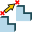
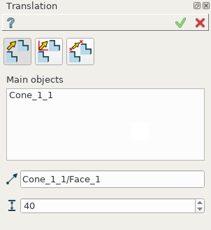
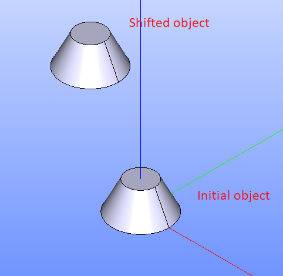
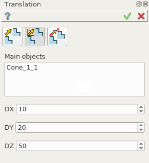
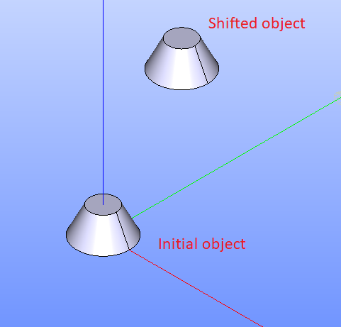
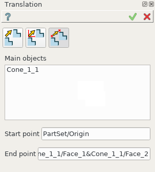
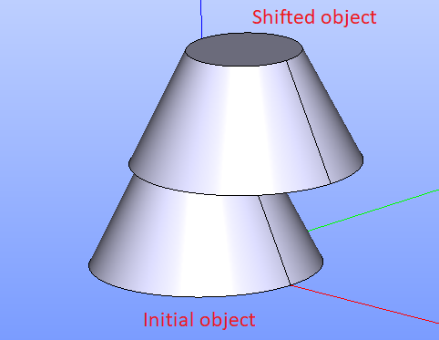

.. _featureTranslation:
.. |translation_vector_32x32.icon|    image:: images/translation_vector_32x32.png
   :height: 16px

Translation
===========

**Translation** feature translates a selected shape.

To create a Translation in the active part:

#. select in the Main Menu *Part - > Translation* item  or
#. click |translation_vector_32x32.icon| **Translation** button in the toolbar

The Vector of translation can be defined in three different ways:

.. image:: images/translation_vector_32x32.png    
   :align: left
   :height: 24px

by by axis and distance

.. image:: images/translation_dxyz_32x32.png      
   :align: left
   :height: 24px

by vector 

by two points

--------------------------------------------------------------------------------

Translation by axis and distance
--------------------------------

.. centered::
  Translation by axis and distance property panel

Input fields:

- **Main objects** panel contains shapes to be translated. The shapes are selected in 3D OCC viewer or object browser;
- **Axis**  defines a vector along which the object will be translated. The vector is an edge or axis selected in 3D OCC viewer or object browser;
- **Distance** defines the distance along the **Vector of translation**.

**TUI Command**:

.. py:function:: model.addTranslation(Part_doc, [shape], axis, dist)

    :param part: The current part object.
    :param list: A list of shapes in format *model.selection(TYPE, shape)*.
    :param object: axis in format *model.selection(TYPE, shape)*.
    :param real: Distance value.
    :return: Result object.

Result
""""""

The result of operation is a shifted initial shape.

.. centered::
   Translation by axis and distance

**See Also** a sample TUI Script of a :ref:`tui_translation_vector` operation.

Translation by vector
---------------------

.. centered::
  Translation by vector property panel

Input fields:

- **Main objects** panel contains shapes to be translated. The shapes are selected in 3D OCC viewer or object browser;
- **DX**, **DY**, **DZ**  define vector using coordinates along the axis.

**TUI Command**:

.. py:function:: model.addTranslation(Part_1_doc, [shape], DX, DY, DZ)

    :param part: The current part object.
    :param list: A list of shapes in format *model.selection(TYPE, shape)*.
    :param real: dX value.
    :param real: dY value.
    :param real: dZ value.
    :return: Result object.

Result
""""""

The result of operation is a shifted initial shape.

.. centered::
   Translation by vector

**See Also** a sample TUI Script of :ref:`tui_translation_DXDYDZ` operation.

Translation by two points
-------------------------

.. centered::
  Translation by two points property panel

Input fields:

- **Main objects** panel contains shapes to be translated. Shapes are selected in 3D OCC viewer or object browser;
- **Start point**  defines start vector point as point or vertex selected in 3D OCC viewer or object browser;
- **End point**  defines end vector point as point or vertex selected in 3D OCC viewer or object browser;
  
**TUI Command**:

.. py:function:: model.addTranslation(Part_doc, [shape], point1, point2)

    :param part: The current part object.
    :param list: A list of shapes in format *model.selection(TYPE, shape)*.
    :param object: A point in format *model.selection(TYPE, shape)*.
    :param object: A point in format *model.selection(TYPE, shape)*.
    :return: Result object.

Result
""""""

The result of operation is a shifted initial shape.

.. centered::
   Translation by two points

**See Also** a sample TUI Script of :ref:`tui_translation_2points` operation.
  
