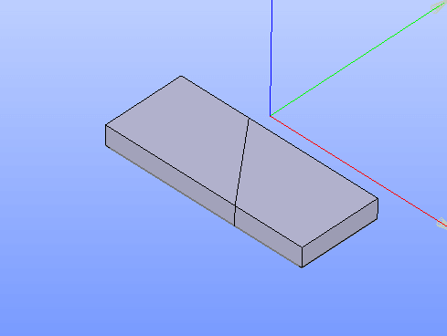

.. |union_btn.icon|    image:: images/union_btn.png

.. _featureUnion:

Union
=====

**Caution**. This operation is obsolete. Fuse operation should be used instead.

Union feature implements a Boolean operation for creation of a union of selected objects.

To create a Union in the active part:

#. select in the Main Menu *Features - > Union* item  or
#. click |union_btn.icon| **Union** button in the toolbar

The following property panel will be opened:

.. figure:: images/Union.png
   :align: center

   **Union operation**

Here it is necessary to select some objects. Only faces with shared edges or solids with shared faces are allowed for selection.

**Apply** button creates a union shape.
  
**Cancel** button cancels the operation.

**TUI Command**:

.. py:function:: model.addUnion(Part_doc, objects)

    :param part: The current part object.
    :param objects: A list of objects.
    :return: Result object.

Result
""""""

The Result of the operation will be a shape which is a union of selected objects:

   **Union created**

**See Also** a sample TUI Script of :ref:`tui_create_union` operation.
