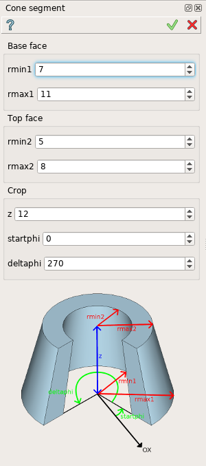
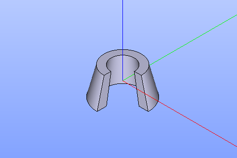

Cone segment
============

The feature Cone segment creates a cone or its segment using GDML language.

To create a Cone segment in the active part:

#. select in the Main Menu *GDML - > Cone segment* item  or
#. click **Cone segment** button in the toolbar.

.. image:: images/cone_btn.png
   :align: center

.. centered::
   **Cone segment**  button 

The following property panel will be opened:

	
.. centered::
   **Cone property panel**

The property panel contains image which explains meaning of input values:

- **rmin1, rmax1** - minimal and maximal radiuses of a base of the cone.
- **rmin2, rmax2** - minimal and maximal rediuses of a top of the cone.
- **z** is a heighth of the cone.
- **startphi** is a starting angle of the cone segment.
- **deltaphi** is an angle to end of the cone segment.

**TUI Command**:  *model.addConeSegment(Part_doc, rmin1, rmax1, rmin2, rmax2, z, startphi, deltaphi)*
  
**Arguments**:    Part + Rmin of base + Rmax of base + Rmin of top + Rmax of top + height + start angle + end angle.

Result
""""""

The Result of the operation will be a SOLID.

		   
.. centered::
   Cone created

**See Also** a sample TUI Script of a :ref:`tui_create_conesegment` operation.
