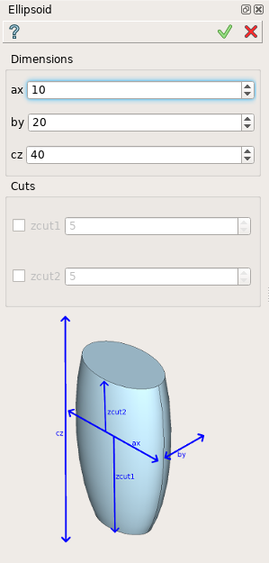
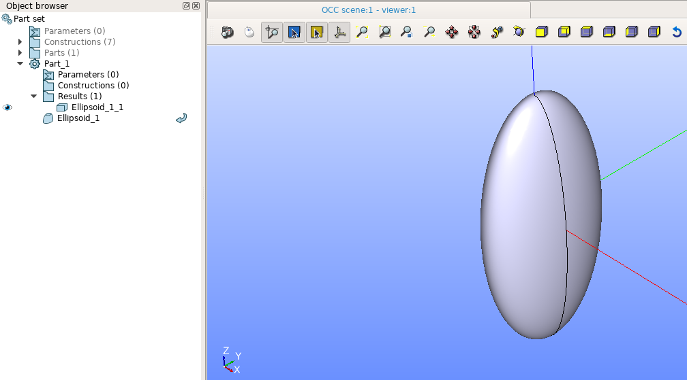

Ellipsoid
=========

Ellipsoid feature creates a 3d ellipsoid or its part using GDML language.

To create an Ellipsoid in the active part:

#. select in the Main Menu *GDML - > Ellipsoid* item  or
#. click **Ellipsoid** button in the toolbar.

.. image:: images/ellips_btn.png
   :align: center

.. centered::
   **Ellipsoid**  button 

The following property panel will be opened:

	
.. centered::
   **Ellipsoid property panel**

The property panel contains an image, which explains the meaning of input values:

- **ax** - ellipsoid size along X axis.
- **by** - ellipsoid size along Y axis.
- **cz** - ellipsoid size along Z axis.
- **zcut1** - z-coordinate of a lower cut plane.
- **zcut2** - z-coordinate of an upper cut plane.

**TUI Command**:  *model.addEllipsoid(Part_doc, ax, by, cz)*
  
**Arguments**:    Part + ax + by + cz.

Result
""""""

The Result of the operation will be a SOLID.

		   
.. centered::
   Ellipsoid created

**See Also** a sample TUI Script of :ref:`tui_create_ellipsoid` operation.
