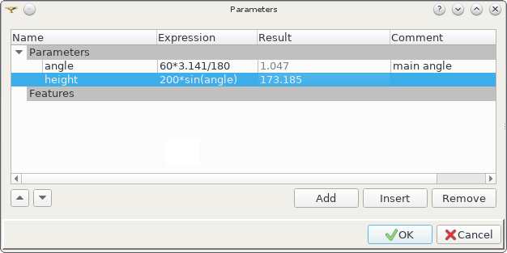

.. _parameters:

Parameters manager
==================

To create/edit a set of parameters in the active partset or part instead of multiply call:

#. select in the Main Menu *Part - > Parameters* item or
#. click **Parameters** button in the toolbar:

.. image:: images/paper_roll.png
   :align: center

.. centered::
   **Parameters** button

The following dialog box with parameter table appears:
   

.. centered::
   Parameters dialog box

**Input fields**:

- **Name**  defines parameter name. Name follows the naming rules of the python language for variables;
- **Expression** inputs manually python expression; 
- **Result** evaluates expression as real number by python *eval()* function;
- **Comment** contains any text. This field is optional;
- **Add** button adds a new empty string in the end of table. Default  **Name** is *<NoName>*, **Expression** is   *<NoValue>* 
- **Insert** button adds a new empty string before the selected parameter;
- **Delete** button removes the selected parameter from the table;   
- **Modify parameter position** button moves the selected parameter
    .. image:: images/parameters_up.png
      :align: left
    up on 1 string in the table,
  
    .. image:: images/parameters_down.png
      :align: left
    down on 1 string in the table.

  
**TUI Command**: *model.addParameter(Part_doc, Name, Value, Comment)*

**Arguments**:  1 Part + 1 string + 1 value + 1 string

**See Also** a sample TUI Script of a :ref:`tui_parametersFeature` operation.

Result
------

Created parameters and their current values are displayed in the Object Browser, in a special section **Parameters**. 

.. image:: images/object_browser_parameters.png
   :align: center

.. centered::
   **Parameters** in object browser
