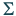
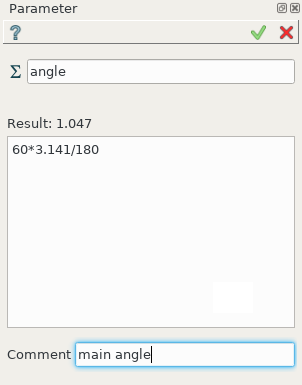
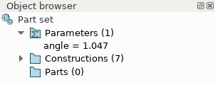

.. _parameter:

Create parameter
================

The parameter can be defined in form *variable=expression*.

To create a parameter in the active partset or part:

#. select in the Main Menu *Part - > Parameter* item or
#. click |expression.icon| **Parameter** button in the toolbar:

The following property panel appears.
   

.. centered::
   Parameter property panel

**Input fields**:

- |expression.icon| defines parameter name following the naming rules of the python language for variables;

- panel **Expression** evaluates the expression input manually as a real number by python *eval()* function. In the simplest case an expression is a real number. Some standard python modules (like math) are imported by default before evaluation.

- **Comment** contains any text. This field is optional.

The property panel checks validity of the expression. For an invalid expression **Apply** button is disabled and an error message generated by python interpreter during the evaluation is shown in the status bar and in pop-up of **Apply** button.

**TUI Command**:

.. py:function:: model.addParameter(Part_doc, Name, Value, Comment)

    :param part: The current part object
    :param string: The parameter name
    :param number: The parameter value
    :param string: The parameter comment
    :return: Created object.

**See Also** a sample TUI Script of a :ref:`tui_parameterFeature` operation.

Result
------

The created parameter and its current value are displayed in the Object Browser, in a special section **Parameters**. 

.. centered::
   **Parameter** in object browser
