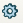

.. _partPlugin:

Part plug-in
============

New Part
--------

To create a New Part:

#. select in the Main Menu *Part - > New part* item  or
#. click **New part** button in Shaper toolbar:

.. centered::
   New part button 

**TUI Command**: *model.addPart(partSet)*

**Arguments**:  1 partset 

Result
""""""

Created empty part is activated and appears in the object browser.

**See Also** a sample TUI Script of a :ref:`tui_create_part` operation.

Duplicate Part
--------------

To duplicate active Part:

#. select in the Main Menu *Part - > Duplicate part* item  or
#. click **Duplicate part** button in Shaper toolbar:

.. image:: images/duplicate.png 
  :align: center

.. centered::
   Duplicate part button    

Result
""""""

Created copied part is activated and appears in the object browser.

Copied part contains all objects existing in the source part.

Remove Part
-----------

To remove active Part:

#. select in the Main Menu *Part - > Remove part* item  or
#. click **Remove part** button in Shaper toolbar:

.. centered::
   Remove part button    

Result
""""""

Selected part is removed together with all its objects.

