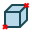
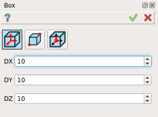
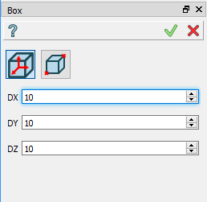
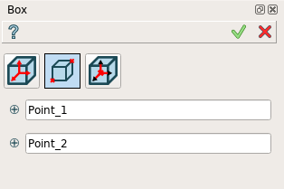
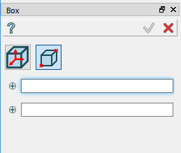

.. _box_feature:

Box
===

Box feature creates a box solid.

To create a Box in the active part:

#. select in the Main Menu *Primitives - > Box* item  or
#. click **Box** button in the toolbar:

.. centered::
   **Box**  button 

There are 2 algorithms for creation of a Box:

**By dimensions** 

**By two points** 

By dimensions
-------------

Box is created by dimensions along X, Y, Z axis starting from the origin.

Input fields:

- **DX**, **DY**, **DZ** define dimensions of the box along the corresponding coordinate axes. 

**TUI Command**:  *model.addBox(Part_doc, DX, DY, DZ)*
  
**Arguments**:    Part + 3 real values (dimensions at origin).

Result
""""""

A solid box based on the origin of coordinates and with edges parallel to the coordinate axes.

**See Also** a sample TUI Script of a :ref:`tui_create_boxdim` operation.

By two points
-------------

Box is created by two points of the box diagonal.

Input fields:

- **Point 1** and **Point 2**  define diagonal points of the box selected in 3D OCC viewer or object browser.
  
**TUI Command**:  *model.addBox(Part_doc, point1, point2)*

**Arguments**:   Part + 2 selected points (opposite vertices of the box)

Result
""""""

A solid box based on two points and with edges parallel to the coordinate axes.

		   
.. centered::
   Created boxes

**See Also** a sample TUI Script of :ref:`tui_create_boxpnt` operation.
