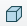
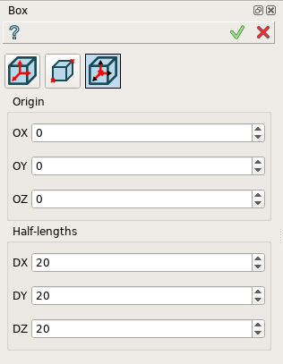
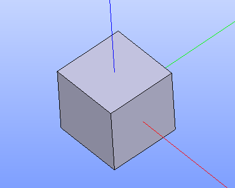

Box
===

Box feature creates a box solid.

To create a Box in the active part:

#. select in the Main Menu *Primitives - > Box* item  or
#. click |Box_button.icon| **Box** button in the toolbar:

There are 3 algorithms for creation of a Box:

.. figure:: images/box_dxyz_32x32.png
   :align: left
   :height: 24px

**By dimensions** 

.. figure:: images/box_2pt_32x32.png
   :align: left
   :height: 24px

**By two points** 

**By coordinates of a point and dimensions** 

--------------------------------------------------------------------------------

By dimensions
-------------

Box is created by dimensions along X, Y, Z axis starting from the origin.

.. figure:: images/Box_dimensions.png
   :align: center

Input fields:

- **DX**, **DY**, **DZ** define dimensions of the box along the corresponding coordinate axes. 

**TUI Command**:

.. py:function:: model.addBox(Part_doc, DX, DY, DZ)
  
    :param part: The current part object.
    :param real: Size along X.
    :param real: Size along Y.
    :param real: Size along Z.
    :return: Result object.

Result
""""""

A solid box based on the origin of coordinates and with edges parallel to the coordinate axes.

.. figure:: images/Box1.png
   :align: center

**See Also** a sample TUI Script of a :ref:`tui_create_boxdim` operation.

By two points
-------------

Box is created by two points of the box diagonal.

.. figure:: images/Box_2points.png
   :align: center

Input fields:

- **Point 1** and **Point 2**  define diagonal points of the box selected in 3D OCC viewer or object browser.
  
**TUI Command**:

.. py:function:: model.addBox(Part_doc, point1, point2)

    :param part: The current part object.
    :param object: First vertex of diagonal.
    :param object: Second vertex of diagonal.
    :return: Result object.

Result
""""""

A solid box based on two points and with edges parallel to the coordinate axes.

.. figure:: images/Box2.png
   :align: center
		   
   Created boxes

**See Also** a sample TUI Script of :ref:`tui_create_boxpnt` operation.

By coordinates of a point and dimensions
----------------------------------------

Box is created by dimensions along X, Y, Z axis starting from the point of coordinates (x,y,z).

Input fields:

- **OX**, **OY**, **OZ** define coordinates of the center of box.
- **DX**, **DY**, **DZ** define dimensions (hafl length) of the box along the corresponding coordinate axes.
  
**TUI Command**:

.. py:function:: model.addBox(Part_doc, OX, OY, OZ, DX, DY, DZ)

    :param part: The current part object.
    :param real: X coordinate of the center point
    :param real: Y coordinate of the center point
    :param real: Z coordinate of the center point
    :param real: Half size along X.
    :param real: Half size along Y.
    :param real: Half size along Z.
    :return: Result object.

Result
""""""

A solid box whose point coordinates are the center and the dimensions are half lengths on one side and the other on the axes relative to the center.

		   
   Created boxes

**See Also** a sample TUI Script of :ref:`tui_create_boxptdim` operation.
