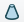
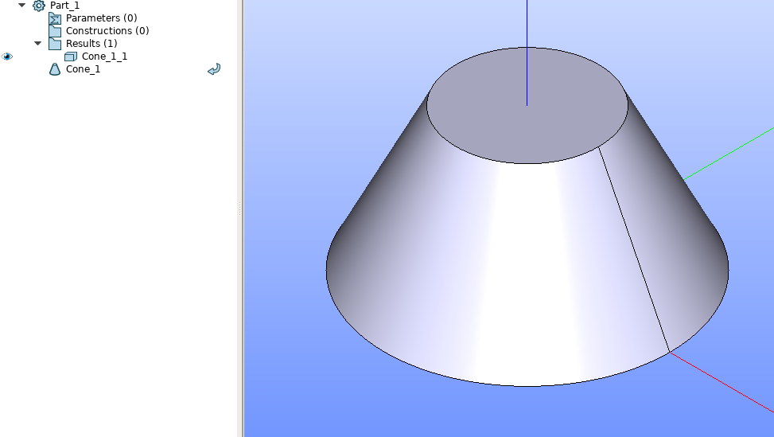

Cone
====

The feature Cone creates a cone solid.

To create a Cone in the active part:

#. select in the Main Menu *Primitives - > Cone* item  or
#. click **Cone** button in the toolbar

.. centered::
   **Cone** button 

The following property panel appears.

.. image:: images/Cone.png
  :align: center

.. centered::
   Cone property panel

Input fields:

- **Point** defines center of the cone base selected in 3D OCC  viewer or object browser; 
- **Vector** defines the axis of the cone selected in 3D OCC  viewer or object browser;
- Dimensions:      
   - **Base Radius**;
   - **Top radius**;  
   - **Height**.
  
**TUI Command**: *model.addCone(Part_doc, Point, Axis, Radius1, Radius2, Height)* 

**Arguments**:  Part + 1 vertex + 1 vector + 3 real values (base and top radii, heght).

Result
""""""

If both radii are non-zero, then the cone will be truncated.

If the radii are equal, the Cylinder will be created instead of cone.

		   
.. centered::
   Cone created  

**See Also** a sample TUI Script of a :ref:`tui_create_cone` operation.
