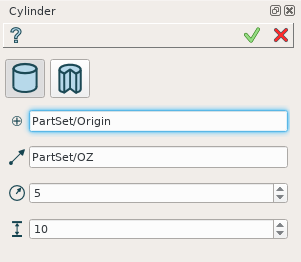
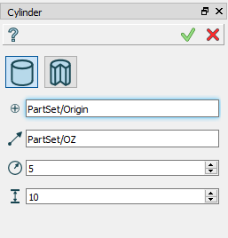
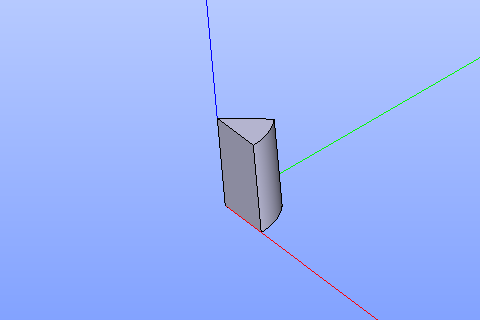

Cylinder
========

The feature Cylinder creates a cylinder solid.

To create a Cylinder in the active part:

#. select in the Main Menu *Primitives - > Cylinder* item  or
#. click **Cylinder** button in the toolbar

.. image:: images/Cylinder_button.png
   :align: center

.. centered::
   **Cylinder** button 

There are 2 algorithms for creation of a Cylinder:

.. image:: images/cylinder_32x32.png
   :align: left
**Cylinder** creates a cylinder.

.. image:: images/cylinder_portion_32x32.png
   :align: left
**Portion of cylinder** creates one segment of cylinder.

Cylinder
--------

	
.. centered::
   **Cylinder** property panel

Input fields:

- **Point** defines center of the cylinder base selected in 3D OCC  viewer or object browser; 
- **Vector** defines the axis of the cylinder selected in 3D OCC  viewer or object browser;
- Dimensions:      
   - **Radius**;
   - **Height**.    

**TUI Commands**: *model.addCylinder(Part_doc, Point, Axis, Radius, Height)*

**Arguments**:   Part + 1 vertex +1 vector +  2 real values (radius, height).

Result
""""""

Example is shown below.

		   
.. centered::
   Cylinder  

**See Also** a sample TUI Script of a :ref:`tui_create_cylinder` operation.

Portion of cylinder
-------------------

.. image:: images/Portion_cylinder.png
	   :align: center
		   
.. centered::
   **Portion of cylinder**  property panel 

Input fields for ***Portion of cylinder** tab includes in addition **Angle** to create a portion of cylinder.

**TUI Commands**: *model.addCylinder(Part_doc, Point, Axis, Radius, Height,Angle)*
  
**Arguments**:   1 Part + 1 vertex +1 vector +  3 real values (radius, height and angle).

Result
""""""

Example is shown below.

		   
.. centered::
   Portion of cylinder  

**See Also** a sample TUI Script of a :ref:`tui_create_cylportion` operation.
