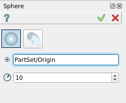
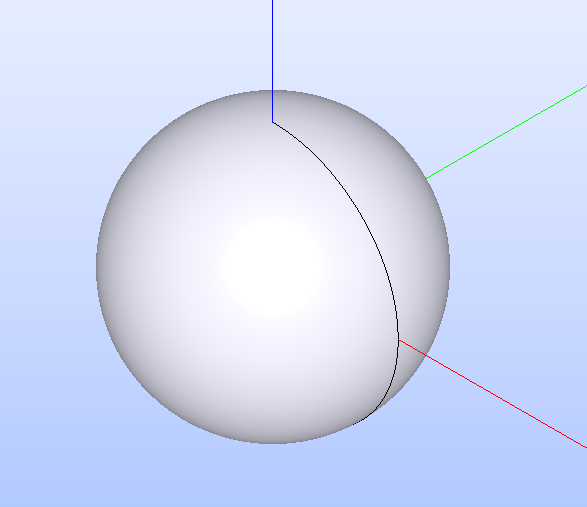
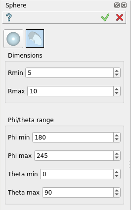
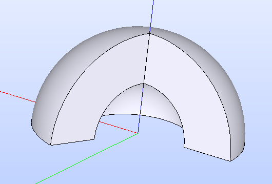

.. |Sphere_button.icon|    image:: images/Sphere_button.png

Sphere
======

Sphere feature creates a sphere solid or a part of a sphere solid.

To create a Sphere in the active part:

#. select in the Main Menu *Primitives - > Sphere* item  or
#. click |Sphere_button.icon| **Sphere** button in the toolbar

There are 2 algorithms for creation of a Sphere

.. figure:: images/sphere_32x32.png
   :align: left
   :height: 24px

**By a center and a radius** 

.. figure:: images/sphere_part_32x32.png
   :align: left
   :height: 24px

**By radii (inner and outer) and angle limits (theta and phi)** 

--------------------------------------------------------------------------------

By a center and a radius
------------------------

Sphere is created by a center (origin by default) and a radius.

Input fields:

- **Point** defines the center of the sphere selected in 3D OCC  viewer or object browser; 
- **Radius** defines the radius.

**TUI Command**:

.. py:function:: model.addSphere(Part_doc, Point, Radius)
  
    :param part: The current part object.
    :param object: Vertex.
    :param real: Radius.
    :return: Result object.

Result
""""""

A solid sphere based on the origin and a radius.

**See Also** a sample TUI Script of a :ref:`tui_create_sphere` operation.

By radii (inner and outer) and angle limits (theta and phi)
-----------------------------------------------------------

Part of sphere is created by radii (inner and outer) and angle limits (phi and theta).

Input fields:

- **RMin** defines the inner radius;
- **RMax** defines the outer radius;
- **PhiMin** defines the lower phi limit;
- **PhiMax** defines the higher phi limit;
- **ThetaMin** defines the lower theta limit;
- **ThetaMax** defines the higher theta limit.

**TUI Command**:

.. py:function:: model.addSphere(Part_doc, RMin, RMax, PhiMin, PhiMax, ThetaMin, ThetaMax)
  
    :param part: The current part object.
    :param real: Inner radius.
    :param real: Outer radius.
    :param real: Lower phi.
    :param real: Hiher phi.
    :param real: Lower theta.
    :param real: Hiher theta.
    :return: Result object.

Result
""""""

A solid sphere based on the origin with radii (inner and outer) and angles (phi and theta).

**See Also** a sample TUI Script of a :ref:`tui_create_part_sphere` operation.
   

   
