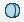
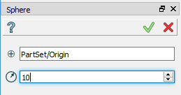
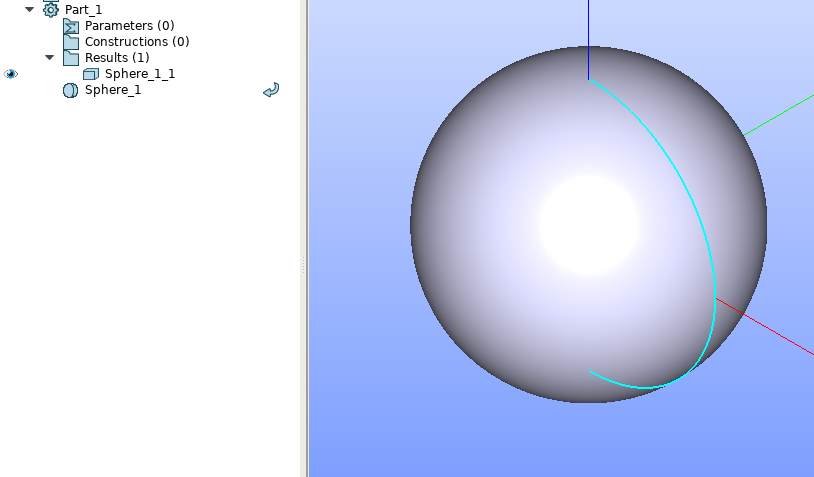

Sphere
======

Sphere feature creates a sphere solid.

To create a Sphere in the active part:

#. select in the Main Menu *Primitives - > Sphere* item  or
#. click |Sphere_button.icon| **Sphere** button in the toolbar

The following property panel appears.

.. centered::
   Sphere property panel
   
Input fields:

- **Point** defines the center of the sphere selected in 3D OCC  viewer or object browser; 
- **Radius** defines the radius.
  
**TUI Command**:

.. py:function:: model.addSphere(Part_doc, Point, Radius)

    :param part: The current part object.
    :param object: Vertex.
    :param real: Radius.
    :return: Result object.

Result
""""""

An example is shown below.

		   
.. centered::
   Sphere created  

**See Also** a sample TUI Script of :ref:`tui_create_sphere` operation.
