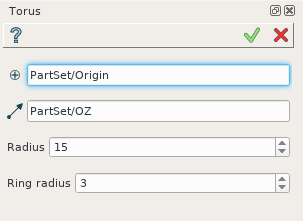
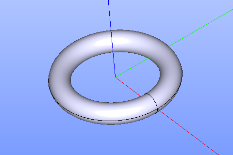

Torus
=====

Torus feature creates a torus solid.

To create a Torus in the active part:

#. select in the Main Menu *Primitives - > Torus* item  or
#. click |Torus_button.icon| **Torus** button in the toolbar

The following property panel appears.

.. centered::
   Torus

Input fields:

- **Point** defines the center of the torus base selected in 3D OCC  viewer or object browser; 
- **Vector** defines the axis of the torus selected in 3D OCC  viewer or object browser;
- Dimensions:      
   - **Radius**;
   - **Ring radius**.
  
**TUI Command**:

.. py:function:: model.addTorus(Part_doc, Point, Axis, Radius1, Radius2)

    :param part: The current part object.
    :param object: Vertex.
    :param object: Axis.
    :param real: Radius 1.
    :param real: Radius 2.
    :return: Result object.

Result
""""""

An example is shown below.

		   
.. centered::
   Torus created  

**See Also** a sample TUI Script of :ref:`tui_create_torus` operation.
  
