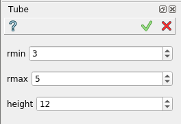
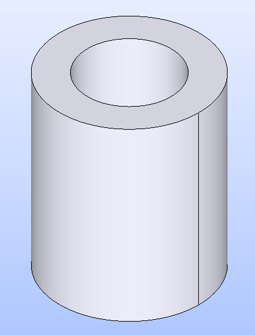

Tube
====

Tube feature creates a tube solid.

To create a Tube in the active part:

#. select in the Main Menu *Primitives - > Tube* item  or
#. click |Tube_button.icon| **Tube** button in the toolbar

The following property panel appears.

   Tube

Input fields:

- **rmin** defines the inner radius of the the tube; 
- **rmax** defines the outer radius of the the tube;
- **height** defines the height of the the tube;
  
**TUI Command**:

.. py:function:: model.addTube(Part_doc, rmin, rmax, height)

    :param part: The current part object.
    :param real: rmin.
    :param real: rmax.
    :param real: height.
    :return: Result object.

Result
""""""

An example is shown below.

		   
   Tube created  

**See Also** a sample TUI Script of :ref:`tui_create_tube` operation.
