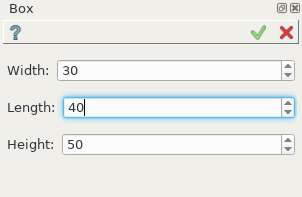
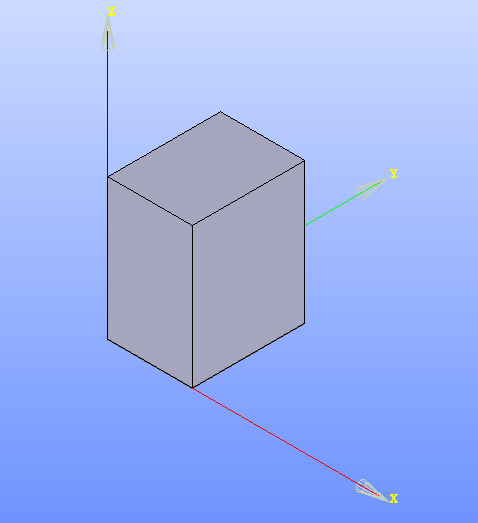

Box
===

Custom files for feature **Box** are:

-  empty __init__.py,
- :ref:`create_custom_box_py`,
- :ref:`create_custom_box_xml`,
- icon.png located at sub-folder */icons*.

.. image:: images/box_ico.png
   :align: center

.. centered::
   File icon.png

The custom feature **Box** creates a box solid by extrusion of rectangle.

To create a Box in the active part:

#. select in the Main Menu *Macros - > Box* item  or
#. click **Box** button in the Macros toolbar corresponding to file icon.png:

The following property panel appears. 

.. centered::
  Create a box

Input fields: 

- **Width**, **Length**, **Height** are sizes of the box along corresponding coordinate axes. The box will be created starting from the origin.   

Result
""""""

The Result of operation will be Extrusion and Sketch. 

The edges of the box will be parallel to the coordinate axes.

		   
.. centered::
   Box created 