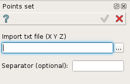
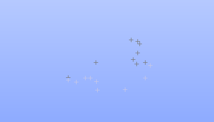

.. _create_compound_Vertices:
.. |compoundVertices.icon|    image:: images/compound.png

compound Vertices
=================

Compound Vertices is a feature and can be edited after execution.
It allows creation of several points basing on XYZ coords file.

.. warning::
  Please note that it is better to limit yourself to create a maximum of 100 points.

These set of points will be grouped in a compound and can be used for others features. 

To add a new set of points:

#. select in the Main Menu *Macros - > Points set* item  or
#. click |compoundVertices.icon| **Points set** button in Macros toolbar:

The following property panel appears:

.. centered::
   set of Points

Select your points file and define a separator if it's different that " " in your points file

Result
""""""

A resulting compound will contain the points 

.. centered::
   Points
