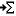
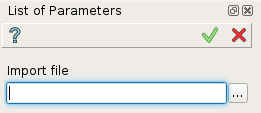

.. _create_import_Parameters:

import Parameters
=================

Import Parameters is a macro-feature and can not be edited after execution.
It allows creation of several parameters basing on variables-values file.

To import parameters:

#. select in the Main Menu *Macros - > import Parameters* item  or
#. click |importParameters.icon| **import Parameters** button in Macros toolbar:

The following property panel appears:

.. centered::
   Import Parameters

Result
""""""

Several parameters are automatically created.
