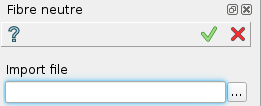

.. _create_midSurface:
.. |midSurface.icon|    image:: images/midSurface.png

Fibre neutre
============

FIbre neutre est une macro fonction qui ne peut pas être éditée après usage.
Elle permet de créer les surfaces médianes à des solides minces, encore appelées fibres neutres (mid surfaces en anglais).

Pour créer les fibres neutres d'un objet :

#. Choisir dans le menu principal *Macros - > Créer des fibres neutres* item  ou
#. Cliquer le bouton |midSurface.icon| **Fibre neutre** dans la barre des macros.

Le menu suivant apparaît :

   Fibre neutre

On doit fournir le fichier de type **CAO** qui contient l'objet. On retrouve dans l'arbre d'étude du module SHAPER cet objet de départ et un dossier contenant toutes les surfaces correspondant à des fibres neutres. Son nom est celui de l'objet de départ, suffixé par **_M**.

.. note::
  Les surfaces ainsi créées ne sont pas reliées entre elles. Il reste ensuite un travail de jonction à effectuer.

Plus :
""""""

Le programme crée les surfaces sous réserve que pour le solide envisagé, il a réussi à trouver deux faces \
de tailles proches et supérieures aux autres faces du solide pour des polyèdres ou \
s'il a reconnu des formes canoniques.
Il crée alors une surface au milieu de ces deux grandes faces. Cette face est coloriée en vert.

Si les 2 faces les plus grandes sont planes mais que leurs tailles ne sont pas identiques, le programme \
crée néanmoins une face basée sur la plus grande de ces faces. Un message est émis et cette face médiane \
est coloriée en bleu. Le volume correspondant n'est pas détruit et est colorié en rouge.

On sait traiter les faces :

- planes
- cylindriques
- sphériques
- toriques
- coniques

Exemple :
"""""""""

A partir d'un ensemble de 4 solides de forme torique :

   Solides à traiter

on obtient 4 surfaces indépendantes :

   Surfaces

   Surfaces dans les solides

