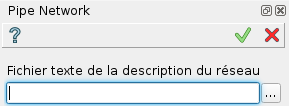
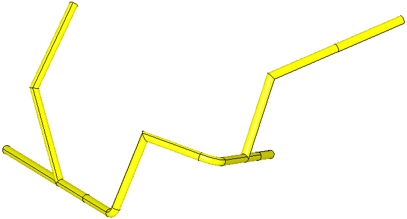

.. _pipeNetwork:
.. |pipeNetwork.icon|    image:: images/pipeNetwork.png

Réseau de tuyaux
================

Cette macro crée les objets SHAPER correspondant à un réseau de tuyauteries décrit dans un fichier texte.

Pour créer l'objet de la tuyauterie :

#. Choisir dans le menu principal *Macros - > Réseau de tuyaux* ou
#. Cliquer le bouton |pipeNetwork.icon| **Réseau de tuyaux** dans la barre des macros.

Le menu suivant apparaît :

   Menu de création du réseau de tuyaux

On doit fournir le fichier de type texte qui contient le réseau. Sa syntaxe est décrite plus bas.

Syntaxe du fichier de données
"""""""""""""""""""""""""""""

Règles générales
----------------

- Chaque ligne commençant par # est ignorée
- Une information par ligne
- Sur une ligne, les données sont séparés par des blancs
- Les données sont regroupées en 3 sections : les noeuds, la connectivité, les raccordements
- Une section débute par **mot-clé section**

Les noeuds
----------

- Repérage avec **nodes section**

- Pour un noeud dont on donne les coordonnées en absolu :

``Identifiant du noeud, le signe -, les 3 coordonnées``

- Pour un noeud défini par rapport à un autre :

``Identifiant du noeud, identifiant du noeud de départ, les 3 coordonnées de la translation``

La connectivité
---------------

- Repérage avec **connectivity section**
- Choix de la méthode de description avec **method=par_ligne** ou **method=2par2**

- Pour la méthode en ligne :

Chaque ligne est décrite par la suite de ses noeuds repérés par leurs identifiants :

``Identifiant du noeud n°1, identifiant du noeud n°2, ..., identifiant du dernier noeud``

- Pour la méthode 2 par 2 :

Chaque tronçon est décrit par les 2 noeuds repérés par leurs identifiants :

``Identifiant du noeud n°1 , identifiant du noeud n°2``

Le raccordement entre tuyaux
----------------------------

- Repérage avec **fillets section**
- Pour chaque noeud à la jonction de 2 tuyaux :

Si la jonction est directe : ``Identifiant du noeud, angular_connection``

Si la jonction est courbe : ``Identifiant du noeud, radius=xxx`` où xxx est le rayon de courbure.

.. note::
  Par défaut, la jonction entre deux tuyaux est directe, sans rayon de courbure. On peut donc se passer de l'information ``angular_connection``. Si toutes les jonctions sont directes, on peut se passer totalement de la rubrique **fillets section**.

.. note::
  Une jonction avec un rayon de courbure ne peut avoir lieu que sur un noeud auquel aboutit exactement 2 tuyaux. L'arc de cercle est tracé dans le plan formé par les deux tuyaux. Les deux tuyaux ne doivent donc pas être colinéaires.

Exemple
-------
.. literalinclude:: examples/pipeNetwork_ligne.txt
    :linenos:
    :language: text

   Exemple de réseau

:download:`Téléchargement des données de cet exemple<examples/pipeNetwork_ligne.txt>`

Le pilotage en TUI se fait ainsi :

.. literalinclude:: examples/pipeNetwork.py
    :linenos:
    :language: python

:download:`Téléchargement du pilotage en TUI<examples/pipeNetwork.py>`

