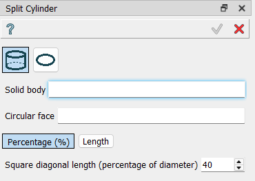
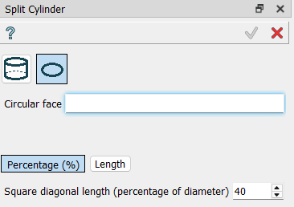

.. _create_split_Cylinder:

Split Cylinder
==============

Split Cylinder allows the splitting of a cylinder or circular face using a
square and the projections of its diagonals, in order to be able to mesh it
using hexahedric or quadrilateral elements.

Usage:

#. select in the Main Menu *Macros - > Split Cylinder* item  or
#. click |splitCylinder.icon| **Split Cylinder** button in Macros toolbar:

The following panel appears:

The default option is to select a solid cylinder and one of its flat faces, and
enter the size of the square in terms of a percentage (100% is a square
inscribed in a circle) or a length (length of the side of the square).

The other option is to split a cirular face, where only the face has to be
selected:

Result
""""""

The cylinder or face is splitted.

All steps are inside a folder.
For a cylinder, there is:
   - Point
   - Sketch
   - Extrusion
   - Split
   - Remove extra edges
And for a circular face, there is:
   - Point
   - Sketch
   - Edges
   - Split