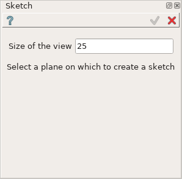
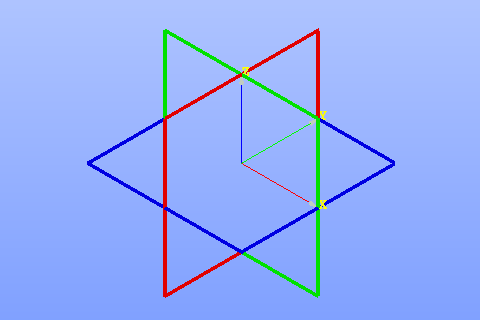
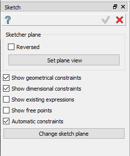
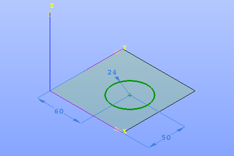
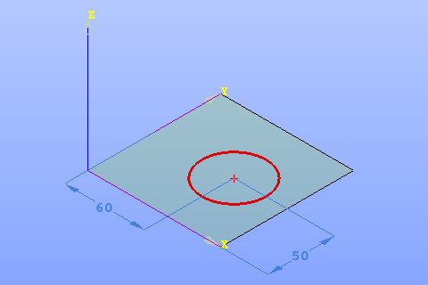

.. _sketchPlugin:

Sketch plug-in
================

Sketch plug-in includes features for creation of 2D shapes.

The sketch creation takes the following steps:

- definition of sketch plane;
- creation of sketch objects from scratch;
- generation of sketch objects via operations on the existing operations;
- definition of constraints.

Sketch can be created in the active part or in a partset (if there is no active part).

To create a Sketch:

#. select in the Main Menu *Sketch - > Sketch* item  or
#. click |SketchButton.icon| **Sketch** button in Sketch toolbar:

First define a plane for the sketch:

- specify plane size (equal to 25 in the example above);
- select the appropriate plane in the viewer.

Note that coordinate planes will be suggested for selection if no convenient objects for plane selection are displayed in the viewer:

After the plane for sketch is selected, the following property panel will be opened:

.. centered::
  Sketch general panel

- **Reversed** check box - allows reversing the sketch plane normal;
- **Set plane view** button - switches the viewer to the top view for the sketch plane;
- **Show geometrical constraints** check box - displays/hides geometrical constraints:
- **Show dimensional constraints** check box - displays/hides dimensional constraints; 
- **Show existing expressions** check box - displays/hides expressions.
- **Show free points** check box - highlights free points in the current sketch if it is checked.
- **Automatic constraints** - automatically create horizontal or vertical constraints if angle between created line and horizontal or vertical less then angular tolerance (defined in preferences).
- **Change sketch plane** button - allows to change working plane of the current sketch.
- **Show remaining DoFs** button - highlights all sketch edges which are not fully constrained.

Now it is possible to:

- create :ref:`sketch objects <sketch_objects>`
- create :ref:`constraints <sketch_constraints>`
- perform :ref:`sketch operations <sketch_operations>`

To apply or cancel sketch creation use Apply and Cancel buttons from the
Sketch panel as well as equivalent buttons from Sketch toolbar.

The Result of operation will be a COMPOUND. In the object tree, Result node is located in
**Constructions** folder.

The Name is assigned automatically: **Sketch_1**, **Sketch_2**, ... both for Feature and Result.

**TUI Command**:

.. py:function:: model.addSketch(PartOrPartSet, plane)

    :param part: The current part object.
    :param object: A plane.
    :return: Result object.

.. _sketch_objects:

Sketch objects
--------------

The plug-in includes the following features for creation of 2D objects:

.. toctree::
   :maxdepth: 1

   pointFeature.rst
   lineFeature.rst
   rectangleFeature.rst
   circleFeature.rst
   arcFeature.rst
   ellipseFeature.rst
   arcEllipseFeature.rst

.. _sketch_constraints:

Constraints
-----------

Constraints are available and viewable during sketch creation or editing.

The goal of constraints creation is to fix sketch geometry, i.e. set degrees of freedom to zero.

If all degrees of freedom are eliminated, the sketch is fixed and displayed with green color.

.. centered::
  Fixed Sketch

If any degrees of freedom remain unsolved, the sketch is under-constrained and displayed with red color.

.. centered::
  Underconstrained Sketch

The plug-in includes the following constraints:

.. toctree::
   :maxdepth: 1

   distanceFeature.rst
   horizontalDistFeature.rst
   verticalDistFeature.rst
   lengthFeature.rst
   angleFeature.rst
   radiusFeature.rst
   horizontalFeature.rst
   verticalFeature.rst
   fixedFeature.rst
   parallelFeature.rst
   perpendicularFeature.rst
   tangentFeature.rst
   coincedentFeature.rst
   middleFeature.rst
   equalFeature.rst
   collinearFeature.rst

.. _sketch_operations:

Operations
----------
Operations modify existing features of the sketch or create new ones by copying them.

The plug-in includes the following operations:

.. toctree::
   :maxdepth: 1

   filletFeature.rst
   splitFeature.rst
   trimFeature.rst
   projectionFeature.rst
   intersectionFeature.rst
   mirrorFeature.rst
   translationFeature.rst
   rotationFeature.rst
   sketchDrawer.rst
