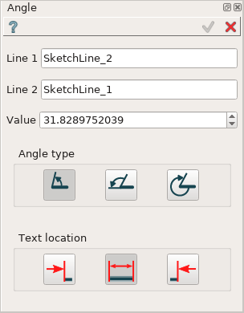
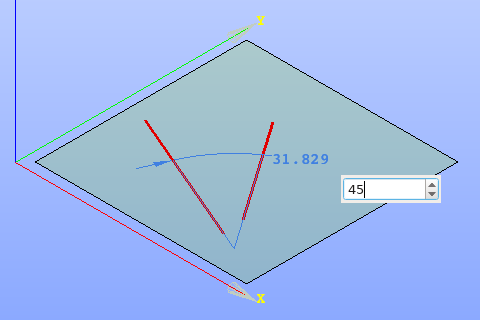
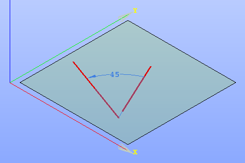

Angle constraint
================

Angle constraint fixes the angle between two lines.

| Angle between two lines is seen as an angle between two vectors.
| Each line is treated as a vector with start and end points equal to those of the line.

To create an Angle constraint in the active Sketch:

#. select in the Main Menu *Sketch - > Angle* item  or
#. click **Angle** button in Sketch toolbar:

.. image:: images/angle_constr.png
   :align: center

.. centered::
   **Angle** button

Property panel:

Input fields:

- **Line 1** is the first line selected in the view;
- **Line 2** is the second line selected in the view;
- **Value** is an angle between the lines, can be modified to set the desirable value;
- **Angle type** is a type of angle measurement:
   .. image:: images/angle_direct.png
      :align: left
   **Direct** is the least angle between two lines;

   .. image:: images/angle_complementary.png
      :align: left
   **Complementary** is 180°- Direct angle between two lines;

   .. image:: images/angle_backward.png
      :align: left
   **Backward** is 360°- Direct angle between two lines.
- **Text location** is the position of the angle value label relatively to the angle line (in the view):
   .. image:: images/location_left.png
      :align: left
   **Left** inserts text to the left of the angle line;

   .. image:: images/location_automatic.png
      :align: left
   **Automatic** inserts text it the middle of the angle line if it has enough length, otherwise - to the left;

   .. image:: images/location_right.png
      :align: left
   **Right** inserts text to the right of the angle line.

When both lines are selected, the angle value is displayed in the property panel and in the view.

When creating the constraint, after selection of two lines at the first time:

- drag the angle presentation in the view to the desired position and click once;
- set desirable angle value in the input field in the view and press **Enter** or just press **Enter** to keep the current angle

.. centered::
   Angle input in the view

**TUI Command**:

- *Sketch_1.setAngle(Line1, Line2, Value)*
- *Sketch_1.setAngleComplementary(Line1, Line2, Value)*
- *Sketch_1.setAngleBackward(Line1, Line2, Value)*

**Arguments**:  2 lines + angle value

Result
""""""

Created Angle appears in the view.

.. centered::
   Angle created

**See Also** a sample TUI Script of :ref:`tui_create_angle` operation.