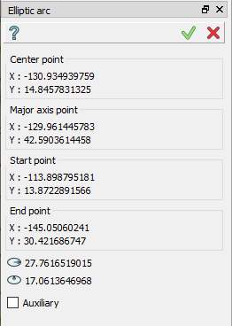
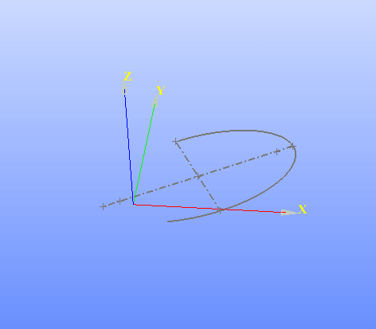

.. |earc.icon|    image:: images/elliptic_arc.png

Elliptic Arc
============

Elliptic Arc feature creates an elliptic arc segment in the current Sketch.

To add a new Elliptic Arc to the Sketch:

#. select in the Main Menu *Sketch - > Elliptic Arc* item  or
#. click |earc.icon| **Elliptic Arc** button in Sketch toolbar:

The following property panel appears:

Click in the view to set the center point, then move the mouse and click a second time to set a point of a one semi-axis, then click to set a starting point of the arc and then to set an end point of the arc.

**TUI Command**:

.. py:function:: Sketch_1.addEllipticArc(CenterX, CenterY, FocusX, FocusY, StartX, StartY, EndX, EndY, Inversed)

    :param real: Center X.
    :param real: Center Y.
    :param real: Focus X.
    :param real: Focus Y.
    :param real: Start X.
    :param real: Start Y.
    :param real: End X.
    :param real: End Y.
    :param boolean: Is inversed.
    :return: Result object.

Result
""""""

Created elliptic arc appears in the view.

   Elliptic arc created

**See Also** a sample TUI Script of :ref:`tui_create_elliptic_arc` operation.