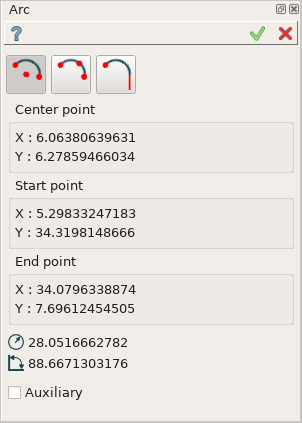
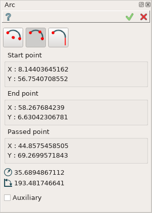
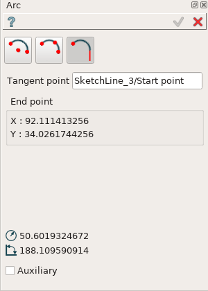
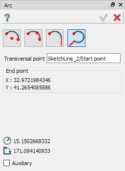
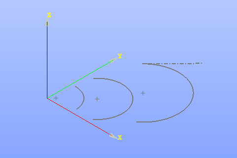

Arc
===

Arc feature creates an arc segment in the current Sketch.

To add a new Arc to the Sketch:

#. select in the Main Menu *Sketch - > Arc* item  or
#. click |arc.icon| **Arc** button in Sketch toolbar:

There are 4 algorithms for creation of an Arc:

.. image:: images/arc_base_32x32.png
   :align: left
**By center and two points** creates an arc segment with the given center passing from the start point to the end point on the circle.

.. image:: images/arc_3pt_32x32.png
   :align: left
**By three points** creates an arc segment passing from the start point to end point through another point on the circle.

.. image:: images/arc_tang_32x32.png
   :align: left
**By tangent point and end point** creates an arc segment with the tangent point and the end point.

**By transversal point and end point** creates an arc segment perpendicular to a straight line with the start point, connected with boundary of this line, and the end point.

By center and two points
""""""""""""""""""""""""

Click in the view once to set the center point, then move the mouse and click a second time to set the start point
and finally move the mouse and click a third time to set the last passed point.

- When entering a center or start point by selecting either a point or a segment, a Coincident constraint is created.
- When entering an end point by selecting a segment, a Coincident constraint is created.
- When entering an end point, only segments are selectable.

**TUI Command**:

.. py:function:: Sketch_1.addArc(CenterX, CenterY, StartX, StartY, EndX, EndY, Inversed)

    :param real: Center X.
    :param real: Center Y.
    :param real: Start X.
    :param real: Start Y.
    :param real: End X.
    :param real: End Y.
    :param boolean: Is inversed.
    :return: Result object.

By three points
"""""""""""""""

Click in the view once to set the start point, then move the mouse and click a second time to set the end point
and finally move the mouse and click a third time to set the passed point.

- When entering a start or end point by selecting either a point or a segment, a Coincident constraint is created.
- When entering a passing point by selecting a point, a Coincident constraint is created.
- When entering a passing point by selecting a segment, a Tangent constraint is created.

**TUI Command**:

.. py:function:: Sketch_1.addArc(StartX, StartY, EndX, EndY, PassedX, PassedY)

    :param real: Start X.
    :param real: Start Y.
    :param real: End X.
    :param real: End Y.
    :param real: Passed X.
    :param real: Passed Y.
    :return: Result object.

By tangent point and point
""""""""""""""""""""""""""

Select a point on segment in the view to set the tangent point, then move the mouse and click to set the end point.
The tangent point by itself is a start point. The edge on which it lies will be tangent to the arc.

- When entering a tangent point by selecting a point on segment, a Tangent constraint is created.
- When entering an end point by selecting a segment, a Coincident constraint is created.
- When entering an end point, only segments are selectable.

**TUI Command**:

.. py:function:: Sketch_1.addArc(TangentPoint, EndX, EndY, Inversed)

    :param object: Tangent Point.
    :param real: End X.
    :param real: End Y.
    :param boolean: Is inversed.
    :return: Result object.

By transveral point and point
"""""""""""""""""""""""""""""

Select a point on a straight segment in the view to set the transversal point, then move the mouse and click to set the end point.
The transversal point by itself is a start point. The edge on which it lies will be perpendicular to the arc (the center of the arc is lying on the edge).

- When entering a transversal point by selecting a point on segment, a Perpendicular constraint is created.
- When entering an end point by selecting a segment, a Coincident constraint is created.
- When entering an end point, only segments are selectable.

**TUI Command**:

.. py:function:: Sketch_1.addArc(TransversalPoint, EndX, EndY, Inversed, True)

    :param object: Transversal Point.
    :param real: End X.
    :param real: End Y.
    :param boolean: Is inversed.
    :param boolean: Arc is transversal (always True).
    :return: Result object.

Result
""""""

Created arc appears in the view.

.. centered::
   Circle created

**See Also** a sample TUI Script of :ref:`tui_create_arc` operation.