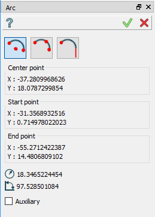
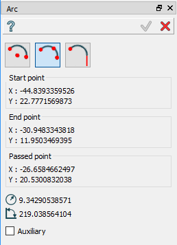

Arc
===

.. centered::
  Create arc by center and two points

.. centered::
  Create arc by three points

.. image:: images/Arc3.png
  :align: center

.. centered::
  Create arc as tangent to an edge
